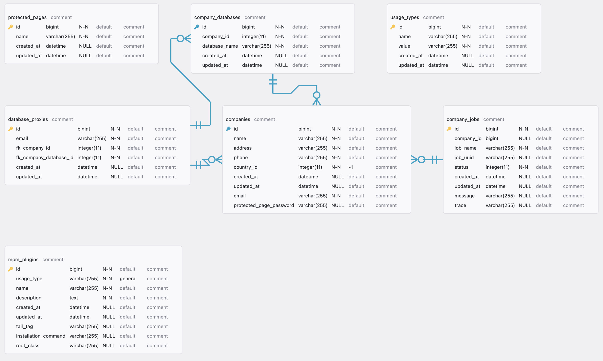
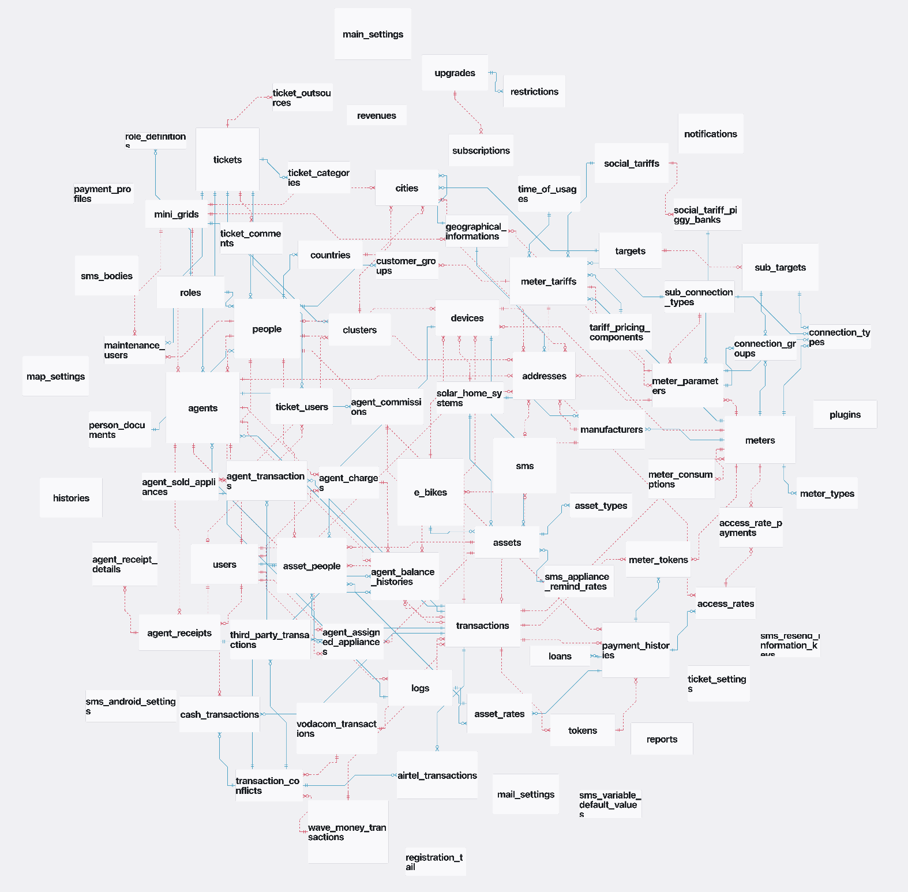
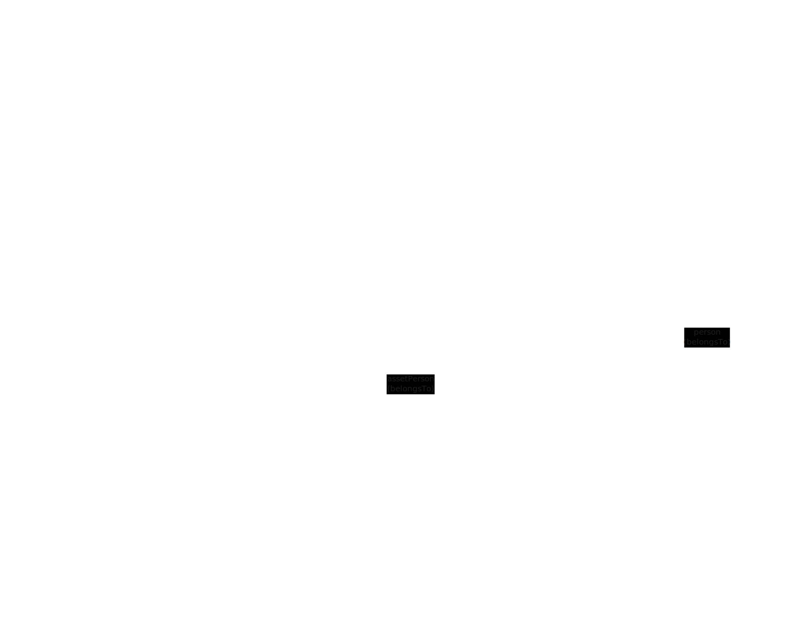

# Backend

The backend is built with [Laravel](https://laravel.com/).
The backend is served under <http://localhost:8000/api>.
You can find backend files under `src/backend`.
After the first run with `docker-compose up`, dependencies will be installed automatically.
If you prefer to install dependencies manually or need to add additional packages, follow these steps:

1. Enter the Docker container named "laravel":

   ```bash
   docker exec -it backend-dev bash
   ```

2. Run the following command to install dependencies, replacing {package-name} with the actual name of the package:

   ```bash
    ./composer.phar install {package-name}
   ```

These steps ensure that you can manage dependencies either automatically during the initial docker-compose up or
manually when needed.
Make sure to replace `{package-name}` with the actual name of the package you want to install.

We followed the laravel folder structure for the backend.
If you want to learn more about the folder structure, you can check the [Laravel documentation](https://laravel.com/docs/9.x/structure).

## Artisan and Tinker caveats

Our Multi-tenancy design uses two Laravel connections: `micro_power_manager` for the central database and `tenant` for the tenant databases.

On normal operation the `tenant` database connection is set on-the-fly by MicroPowerManager.
As a result not all Artisan and Tinker commands might work out-of-the-bos when called from shell.

### Viewing Tenant models

To view a Model in `tenant` space, make sure you have a local development setup, then call `model:show-tenant` instead of `model:show`.

For example

```sh
php artisan model:show-tenant Agent
php artisan model:show-tenant "Meter\Meter"
```

### Using Artisan Tinker Shell

As a first step in a Tinker shell configure the DemoCompany `tenant` connection like so:

```php
$databaseProxyManagerService = app(\MPM\DatabaseProxy\DatabaseProxyManagerService::class);
$databaseProxyManagerService->buildDatabaseConnectionDemoCompany();
```

Then you can use Tinker to create Tenant models

```php
$person = new \App\Models\Person\Person();
$person->name = 'A Name'
$person->surname = 'A Surname'
$person->save();
```

## Schemas

### Central Database Schema

<!-- prettier-ignore -->
[](/schemas/central_database/index.html){target="_self"}

### Tenant Database Schema

<!-- prettier-ignore -->
[](/schemas/tenant_database/index.html){target="_self"}

> [!NOTE]
> The schema of the central database is massive.
> In `erd-editor` you can use `Right Click => Automatic Table Placement` to get nicer overview.

### Transactions abstractions

To model real world transactions and their implications in MicroPowerManager different abstractions are used.

**Transactions:** General purpose system level Transaction.
Used to interact and be linked with other MicroPowerManager objects and models.

**Payment Provider Transactions:** Represents a transaction specific to a payment provider.
Objects and models may contain information specific to the payment provider, for example external id, order id or reference id.

**Manufacturer Transactions:** Represents how the transaction enables or interacts with manufacturer-specific devices.
Objects and models may contain information specific to the manufacturer, for example external id or site id.



## API docs

<!-- prettier-ignore -->
OpenAPI documentation for MPM can be found here: [OpenAPI docs](/openapi/index.html){target="_self"}
