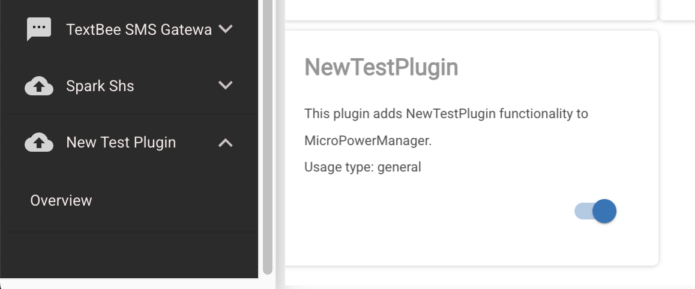

# Plugin Development Guide

This guide will walk you through the process of creating and
integrating a plugin for MicroPowerManager (MPM).

## Overview

Plugins are modular components that extend MPM's functionality.
Each plugin consists of:

- Backend package (`src/backend/app/Plugins/{plugin-name}`)
- Frontend module (`src/frontend/src/plugins/{plugin-name}`)

## Quick Start

1. **Prerequisites**
   - Running [advanced development environment](development-environment.md#advanced-development-environment) with local PHP installation
   - Basic knowledge of Laravel and Vue.js

2. **Create Plugin Template**

   From the root directory of MicroPowerManager in your local development environment, run the following command:

   ```bash
   cd src/backend
   php artisan micropowermanager:new-plugin {plugin-name}
   ```

   Replace `{plugin-name}` with the desired name of your plugin.

   This command:
   - Creates plugin backend code `src/backend/app/Plugins/{plugin-name}`
   - Creates plugin frontend code `src/frontend/src/plugins/{plugin-name}`
   - Automatically generates and registers a new plugin id
   - Automatically performs basic plugin registration (for example in frontend routes and backend plugins table)

3. **Post-Creation Setup**
   - Review generated code structure
   - Follow integration steps below

4. **Example Plugins**
   Check existing plugins for reference:
   - Payment providers (e.g., Calin, Vodacom)
   - Meter manufacturers (e.g., SteamaCo, Spark)
   - SHS manufacturers (e.g., SunKingSHS, Spark SHS)
   - Feature plugins (e.g., Asset Management)

## Integration Steps

The following steps describe how your plugin is integrated with MicroPowerManager.

Most of the fundamental boilerplate setup is handled automatically when you run the `artisan micropowermanager:new-plugin` command.
We won’t go into those generated details here as you can always inspect the changes using git diff to understand what was created behind the scenes.

This guide focuses on the custom integration steps required to extend and connect your plugin to the system.

### Backend Integration

The backend integration process involves several key steps to make your plugin discoverable and functional within MicroPowerManager.

#### Register API Routes

If your plugin needs to handle API requests (e.g., webhooks, custom endpoints), register your route resolver:

```php
// src/backend/app/Services/ApiResolvers/Data/ApiResolvers

class ApiResolverMap {
    // ...other API constants
    public const YOUR_PLUGIN_API = 'api/your-plugin/callback';

    public const RESOLVABLE_APIS = [
        // ...other resolvable APIs
        self::YOUR_PLUGIN_API,
    ];

    private const API_RESOLVER = [
        // ...other API resolvers
        self::YOUR_PLUGIN_API => YourPluginApiResolver::class,
    ];

    public function getResolvableApis(): array {
        return self::RESOLVABLE_APIS;
    }

    public function getApiResolver(string $api): string {
        return self::API_RESOLVER[$api];
    }
}
```

#### Database Setup

Your plugin will might need several database migrations to integrate with MPM:

##### Create Plugin Tables

If your plugin needs to create database tables, the migrations should be placed in the `database/migrations` folder.

The recommended way to create a migration is by using the following command:

```sh
php artisan make:migration-tenant create_your_plugin_table
```

This ensures the migration is generated with the correct configuration for the multi-tenant environment used by MPM.

#### Customise Installation Command

The package generation command already creates a basic plugin installation command.

This command is executed when a user enables your plugin for the first time via the plugin settings menu.

If your plugin requires additional one-time configuration, such as

- creating default credentials
- performing initial setup tasks

you can adapt and customize the installation command accordingly.

```php
<?php
namespace App\Plugins\NewTestPlugin\Console\Commands;

use Illuminate\Console\Command;

class InstallPackage extends Command
{
    protected $signature = 'new-test-plugin:install';
    protected $description = 'Install NewTestPlugin Package';

    public function __construct() {
        parent::__construct();
    }

    public function handle(): void
    {
        $this->info('Installing NewTestPlugin Integration Package\n');

        // Here you can add plugin initialisation code.
        // For example creating initial plugin credentials in the database
        // or registering a Manufacurer with MicroPowerManager.

        $this->info('Package installed successfully..');
    }
}
```

### Frontend Integration

This section describe how to integrate your plugin with the MicroPowerManager frontend.

#### Add Plugin Routes

The package generation command creates a default Overview page and registers a frontend route, making your plugin accessible and visible in the application sidebar.



If your plugin requires a more complex routing or sidebar structure, you can modify your plugin’s section in `ExportedRoutes.js` accordingly.
The sidebar icon can also be customized in this file to better match your plugin’s functionality or branding.

```js
// src/frontend/src/ExportedRoutes.js

import YourPluginOverview from "./plugins/your-plugin/modules/Overview/Overview"

export const exportedRoutes = [
  // ...other routes
  {
    path: "/your-plugin",
    component: ChildRouteWrapper,
    meta: {
      sidebar: {
        enabled_by_mpm_plugin_id: 19, // Your plugin ID from MpmPlugin
        name: "Your Plugin",
        icon: "plugin-icon", // Choose an appropriate icon
      },
    },
    children: [
      {
        path: "your-plugin-overview",
        component: YourPluginOverview,
        meta: {
          layout: "default",
          sidebar: {
            enabled: true,
            name: "Overview",
          },
        },
      },
      // Add more routes as needed
    ],
  },
]
```

#### Customising the Registration Tail

The Registration Trail is displayed after each login once your plugin has been enabled by a user.
Its purpose is to indicate that additional configuration steps may still be required.

The component shown in the trail is configured by registering a global component within your plugin’s namespace in `main.js`.

By default, the package generation command registers the plugin’s overview page.
However, in most cases you will want to replace this with something more meaningful.
For example a configuration screen or credentials setup page to guide users through the remaining setup steps.

```js
// src/frontend/src/main.js

import YourPluginsOtherComponent from "@/plugins/your-plugin/modules/Overview/SomeOtherComponent"

Vue.component("Your-Plugin", YourPluginsOtherComponent)
```

#### Closing the RegistrationTail

To signal to the application that the user has completed the registration process, emit an event with your plugin’s name to the shared `EventBus`.

Once this event is received, the Registration Trail will be closed and will no longer be shown on subsequent logins.

```js
import { EventBus } from "@/shared/eventbus"

EventBus.$emit("Your-Plugin")
```

## Advanced configurations

> [!WARNING]
> This section needs expansion.

- Add plugin pages to Role-based access control (RBAC)
- Creating external endpoints and using access keys

## Testing Your Plugin

1. Install the plugin:

   ```bash
   php artisan your-plugin:install
   ```

   or enable the plugin via the Settings UI.

2. Verify database setup:
   - Check migrations ran successfully
   - Verify tables were created
   - Ensure plugin is registered in `mpm_plugins`

3. Check frontend integration:
   - Plugin appears in sidebar
   - Routes are accessible
   - Components render correctly

## Best Practices

1. **Code Organization**
   - Keep your plugin self-contained as much as possible
   - Follow the established directory structure for consistency
   - Use the MPM core services when appropriate to maintain integration

2. **Testing**
   - Test all features thoroughly
   - Verify database operations
   - Check frontend functionality

3. Document your plugin's features and configuration requirements

4. Use proper versioning for your plugin package

Remember to check existing plugins for reference implementations that might help guide your development.
