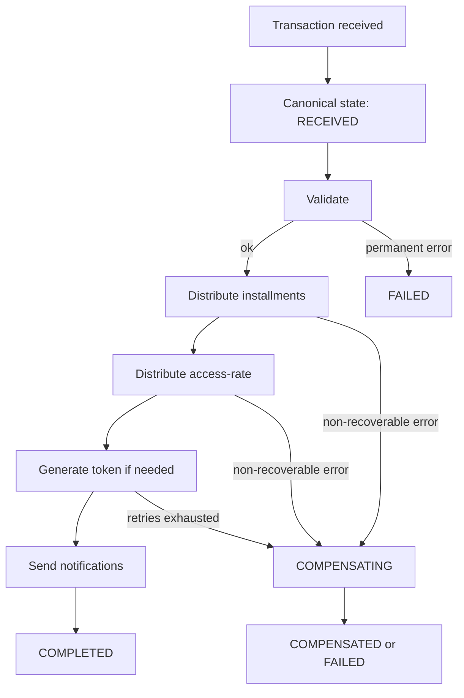

# Transaction Abstraction Revamp

## Why this document

The current transaction system works in production but has grown around multiple implicit flows and provider-specific behaviors.
This document defines a target architecture and a migration strategy that can be rolled out incrementally without a risky rewrite.

## Current constraints (observed in code)

1. Transaction state is implicit and fragmented.

- `transactions.type` is mutated during processing (`src/backend/app/Jobs/EnergyTransactionProcessor.php:56`, `src/backend/app/Jobs/ApplianceTransactionProcessor.php:69`).
- Provider-specific statuses are separate integer fields on multiple models (`src/backend/app/Plugins/SwiftaPaymentProvider/Models/SwiftaTransaction.php:30`, `src/backend/app/Plugins/WaveMoneyPaymentProvider/Models/WaveMoneyTransaction.php:35`, `src/backend/app/Plugins/PaystackPaymentProvider/Models/PaystackTransaction.php:41`).
- There is no stage-level state model in `transactions` (`src/backend/database/migrations/tenant/2018_05_24_201051_create_transactions_table.php:19`).

2. Flow orchestration differs by entry point and transaction type.

- Multiple entry points enqueue `ProcessPayment` independently (`src/backend/app/Http/Controllers/TransactionController.php:42`, `src/backend/app/Http/Controllers/AppliancePaymentController.php:64`, `src/backend/app/Plugins/WaveMoneyPaymentProvider/Http/Middleware/WaveMoneyTransactionCallbackMiddleware.php:46`, `src/backend/app/Plugins/PaystackPaymentProvider/Services/PaystackTransactionService.php:134`).
- `TransactionPaymentProcessor` branches by resolved device type and non-PAYGO appliance checks (`src/backend/app/Services/TransactionPaymentProcessor.php:13`, `src/backend/app/Services/TransactionPaymentProcessor.php:37`).

3. Retry behavior is inconsistent and limited.

- Retries are custom-implemented only in token generation (`src/backend/app/Jobs/TokenProcessor.php:29`, `src/backend/app/Jobs/TokenProcessor.php:92`, `src/backend/app/Jobs/TokenProcessor.php:113`).
- Other stages (validation/payment distribution/notifications) rely on ad-hoc error paths.

4. Idempotency is partial.

- Installment and debt updates mutate balances directly (`src/backend/app/Utils/ApplianceInstallmentPayer.php:133`, `src/backend/app/Utils/AccessRatePayer.php:45`).
- Payment histories are created from events without operation keys (`src/backend/database/migrations/tenant/2018_05_25_131106_create_payment_histories_table.php:14`).

5. Provider resolution is closed to extension.

- `TransactionAdapter` uses explicit `instanceof` chains (`src/backend/app/Providers/Helpers/TransactionAdapter.php:23`).

6. Cash flow diverges from the provider abstraction.

- `CashTransactionService` writes directly and dispatches processing (`src/backend/app/Services/CashTransactionService.php:12`).
- `CashTransactionProvider` contains unimplemented methods (`src/backend/app/Providers/CashTransactionProvider.php:51`).

7. Two critical implementation gaps should be addressed early.

- Token retry condition appears inverted relative to counter initialization (`src/backend/app/Jobs/TokenProcessor.php:29`, `src/backend/app/Jobs/TokenProcessor.php:92`).
- Success/failure listeners check `ITransactionProvider` against provider transaction models, which are different types (`src/backend/app/Listeners/TransactionSuccessfulListener.php:13`, `src/backend/app/Listeners/TransactionFailedListener.php:13`, `src/backend/app/Models/Transaction/AgentTransaction.php:26`).

## Target architecture

### 1) Explicit transaction state machine

Introduce an explicit stage model decoupled from provider-specific status codes.

- Canonical states:
  - `RECEIVED`
  - `VALIDATED`
  - `DISTRIBUTING_INSTALLMENTS`
  - `DISTRIBUTING_ACCESS_RATE`
  - `GENERATING_TOKEN`
  - `DELIVERING_NOTIFICATION`
  - `COMPLETED`
  - `FAILED`
  - `COMPENSATING`
  - `COMPENSATED`

- State dimensions:
  - `current_stage` (single source of truth)
  - `stage_status` (`pending`, `running`, `succeeded`, `failed`, `retry_scheduled`)
  - `failure_reason` (code + message)
  - `attempt_count` and `next_retry_at`

Keep existing provider status fields for compatibility, but treat them as external projections.

### 2) Stage-oriented workflow engine

Represent processing as ordered stage handlers with uniform contracts.

```php
interface TransactionStageHandler {
    public function stage(): TransactionStage;
    public function run(TransactionExecutionContext $context): StageResult;
    public function compensate(TransactionExecutionContext $context): CompensationResult;
}
```

Each transaction purpose uses a workflow definition, for example:

- `EnergyWorkflow`: validate -> installments -> access-rate -> token -> notify
- `DeferredApplianceWorkflow`: validate -> installments -> notify (optional token stage)

### 3) Idempotent operation ledger

Every side effect must be keyed and deduplicated.

- Add an operation ledger table with unique `operation_key`.
- Derive keys per stage and entity, for example:
  - `txn:{id}:installment:{appliance_rate_id}`
  - `txn:{id}:access-rate:{meter_id}`
  - `txn:{id}:token`
  - `txn:{id}:notification:sms`
- Stage handlers must write through a `recordOperation()` helper that is insert-first (unique-key protected) and no-op on duplicate.

### 4) Standard retry policy

Apply retry policies per stage category.

- Transient errors (timeouts, rate limits, deadlocks): exponential backoff with jitter.
- Permanent errors (validation/business constraints): fail stage without retries.
- Retry policy should be data-driven, not hardcoded in one job.

### 5) Compensation model

Compensation becomes explicit and stage-scoped.

- For each stage that mutates financial state, record enough metadata to reverse safely.
- Execute compensation in reverse stage order when a non-recoverable failure occurs.
- Mark compensation outcomes in the same stage/event ledger.

### 6) Provider adapter registry (open/closed)

Replace `instanceof` branching with a registry.

```php
interface ProviderAdapter {
    public function providerType(): string; // morph type / relation name
    public function onSuccess(Transaction $transaction): void;
    public function onFailure(Transaction $transaction, ?string $reason): void;
}
```

Resolution should use container tags or a config map keyed by provider type.
Adding a provider should require registration only, not edits to central orchestration.

### 7) Observability-first design

Add append-only processing events so stuck transactions are queryable.

- `transaction_processing_events` table:
  - `transaction_id`, `stage`, `status`, `attempt`, `occurred_at`, `error_code`, `error_message`, `meta`
- Dashboard queries become straightforward:
  - oldest `running`
  - retries exhausted
  - compensation in-progress
  - high-failure stages per provider

## Suggested schema additions (additive)

1. `transactions` additions

- `processing_state` (string or enum)
- `processing_stage` (string)
- `processing_attempts` (int)
- `last_error_code` (nullable string)
- `last_error_message` (nullable text)
- `next_retry_at` (nullable datetime)
- `processed_at` (nullable datetime)

2. New `transaction_processing_events`

- stage-level timeline for diagnostics and reporting

3. New `transaction_operations`

- idempotency ledger with unique `operation_key`

These are additive and can coexist with current provider tables and status fields.

## Migration strategy

### Phase 0: Baseline observability (no behavior changes)

- Emit stage events around current processors (`ProcessPayment`, `EnergyTransactionProcessor`, `ApplianceTransactionProcessor`, `TokenProcessor`).
- Add dashboards/queries for failed and stuck transactions.

### Phase 1: Introduce canonical processing state (compatibility mode)

- Add new state columns to `transactions`.
- Keep writing legacy fields (`type`, provider statuses), but always update canonical stage/state.

### Phase 2: Wrap existing stages with idempotent operation keys

- Introduce `transaction_operations`.
- Guard installment, access-rate, token generation, and notification side effects with operation-key checks.

### Phase 3: Unified workflow runner behind feature flag

- Add workflow engine and stage handlers.
- Route a subset of providers/transaction types through new runner.
- Keep old processors as fallback.

### Phase 4: Provider adapter registry

- Replace `TransactionAdapter` branching with registry-based resolution.
- Register existing providers without behavior changes.

### Phase 5: Cash flow convergence

- Migrate cash payments to the same workflow and stage/state model.
- Remove divergent direct-processing behavior once parity is validated.

### Phase 6: Decommission legacy orchestration

- Retire duplicate state writes and redundant branching logic.
- Preserve provider-specific status columns only where externally required.

## Feasibility and risk

### Feasibility

- High: additive schema changes and event instrumentation.
- Medium: idempotent keys for all financial mutation paths.
- Medium/High: full workflow runner migration across all providers.

### Main risks

- Duplicate side effects during dual-run periods.
- Inconsistent backward projections if canonical and legacy statuses diverge.
- Hidden provider-specific assumptions in callbacks.

### Risk controls

- Feature flags per provider and transaction type.
- Shadow mode (evaluate new runner without committing side effects).
- Per-stage reconciliation scripts and runbooks.

## Immediate hardening steps

While the full revamp is in progress, prioritize these low-risk improvements:

1. Add explicit stage updates and error codes in current processors.
2. Add idempotency keys around installment and access-rate writes.
3. Add retry policies for transient DB/network failures beyond token generation.
4. Introduce provider registry abstraction while retaining old adapter as fallback.
5. Correct token retry condition and counter handling in `TokenProcessor`.
6. Remove or replace listener type guards so provider success/failure callbacks are executed through adapter resolution.

## Example target flow (high level)


