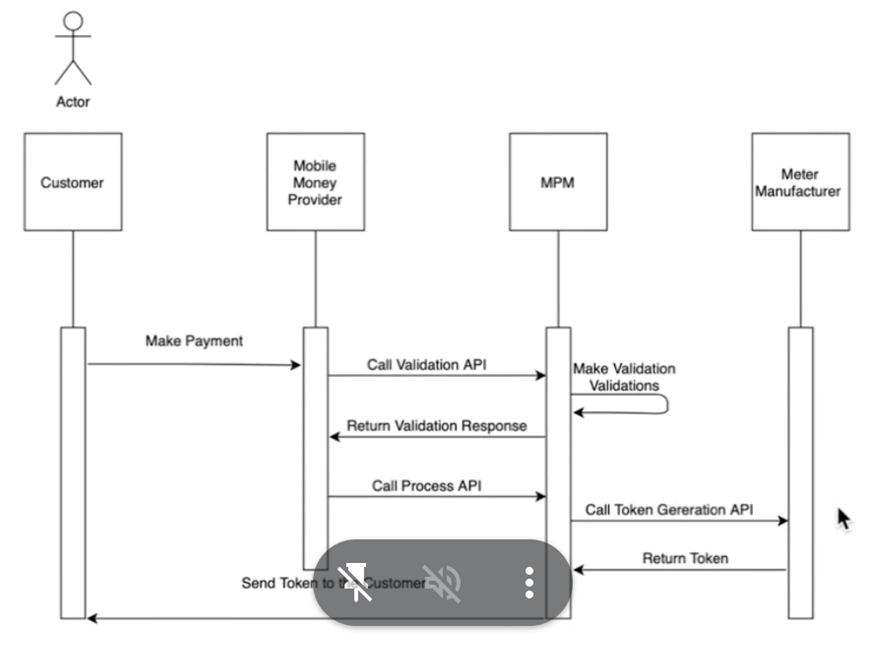
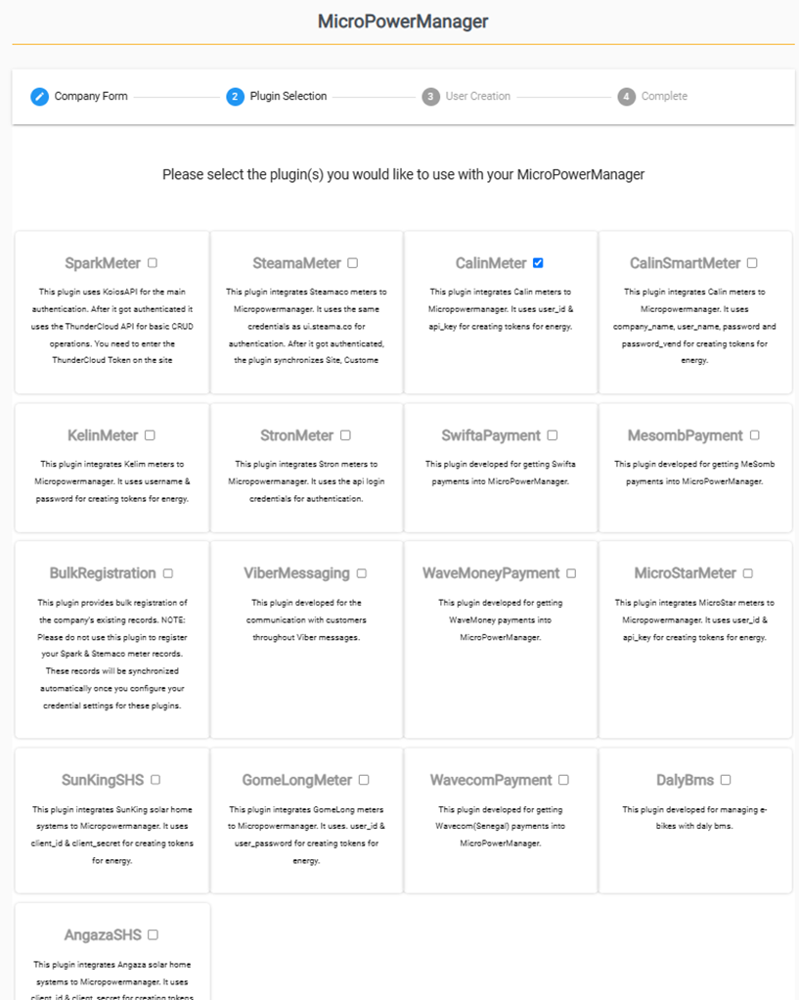

# Get Started with MPM

MicroPowerManager (MPM) is an open source, free-of-charge customer relationship manager (CRM) software that enables companies in the rural electrification space manage their portfolio of customers. It is designed to be suitable both to mini-grid operations as well as solar-home-system (SHS) and e-bike distributors. The software was originally developed by INENSUS GmbH and is now hosted and co-developed by EnAccess. This User Manual is designed for persons with a basic understanding of what a CRM tool, mini-grid and SHS are.

The MPM package includes:
    1.	The **website interface** (where company-level data in regards to gathered revenues and potentially technical operational data) can be accessed. Customer complaints and technical faults can also be managed in a centralized manner via this interface.  “Bulk-registration” of an existing portfolio of customers (transferring customer data from legacy systems to MPM software) can be offered by EnAccess as-a-service. 
    2.	**MPM Android Apps**:
        2.1. **Customer Registration App**: it is required to be able to register new customers.
        2.2. **Agent/Merchant App**: serves as the bilateral communication channel between the company headquarters (users of MPM website interface) and the team of agents on site, managing and responding to customer complaints. The Agent App is also used to manually generate STS tokens (where customers are not able to do so themselves with their own phones).
        2.3. **SMS Gateway App**: required to enable the possibility of sending bulk SMS to customer portfolio via the MPM website interface as well as communicating via SMS with company's agents/maintenance service providers via the MPM website interface.

The 3 apps (APK files) can be downloaded and installed as follows:
    1.	Accessing this link: https://cloud.micropowermanager.com/#/welcome
    2.	Click on the APK app files via your phone (Android required) – For Agent App Android version 6 or above is required)
    3.	Apps get installed
    4.	Once the app is installed on the phone, you will be asked for an URL. Following URL can be used: https://cloud.micropowermanager.com
    5.	Log in to the apps with the login credentials used to access MPM website interface (in case you have access to the website interface) or with the credentials given to you by management.
    
    For more information on how to use the Android Apps, kindly check the "Android Apps" section of this user manual.

# Setting up your MPM company account:

1.	During the sign-up process, you will be required to select the plug-ins relevant to your company (for further information on plug-ins, see further below on this page).
2.	Create users under that company account (a user should be created for every person that should be able to access the company’s MPM account via the website interface as well as persons that should work with the Android apps outlined above).
3.	Create a password for password protected areas, so that only the team members with knowledge of the password can access sensitive information (Password protected areas are: Tariff-setting, Targets-setting, Overall company Settings, Addition of locations (village, mini-grid, cluster)*.
4.	Create the locations (under “Settings”) where your systems/devices are to be located (every device must be assigned to a cluster, mini-grid and village).
5.	Register your customers (with applicable device numbers) and assign them appliances (where applicable), as follows:
    a)	To register new mini-grid customers, the Customer Registration App is required. Basic customer data together with the electricity meter serial number are required (kindly see the “Register a customer & device” section for further information.
    b)	To register new Solar-Home System (SHS) customers, e-bike customers or assign/sell new appliances to existing customers, kindly check the “Register a customer & device” section of this User Manual.

* Password-setting to protect some sections of your account can only be generated at account setting stage. To change this password ex-post, you will have to contact EnAccess (Enaccess can change the password directly on the database).

# MPM Software Plug-ins:
The below diagram depicts the integration layers of MPM with mobile money providers and device manufacturers (whether electricity meter, SHS or e-bike).

**MPM Software Plug-ins**
In order to use MPM software to manage your customer portfolio, you will have to activate the relevant (manufacturer) plug-ins as well as the relevant telecommunication provider plug-ins.
For example, if you have Calin pre-paid meters or SunKing Solar Home Systems in your portfolio, you should activate the “Calin” and “SunKing” plug-ins to be able to manage your customers with MPM software.  Additionally, if your customers rely on Airtel or Vodacom, you should activate the applicable Airtel or Vodacom plug-ins to enable MPM to generate tokens when receiving mobile money payments.

Currently the following manufacturer plug-ins are available:
-	Spark Meter
-	Steama Meter
-	Calin Meter
-	Calin Smart Meter
-	Kelin Meter
-	Stron Meter
-	Microstar Meter
-	Gomelong Meter
-	SunKing Solar Home System (SHS)
-	Angaza Solar Home System (SHS)
-	DalyBms (e-bike)

Currently the following telecommunication provider plug-ins are available:
-	Swifta Payment
-	Mesomb Payment
-	Viber Messaging
-	Wave Money Payment
-	Wavecom Payment
-	Airtel Tanzania (plug-in activation requires additional support by EnAccess)
-	Vodacom Tanzania (plug-in activation requires additional support by EnAccess)
-	Airtel Uganda (plug-in activation requires additional support by EnAccess)
-	Vodacom Mozambique (integration currently on-going)
Note that the activated plug-ins can be changed/removed/added later on from the website interface (under “Settings”).

