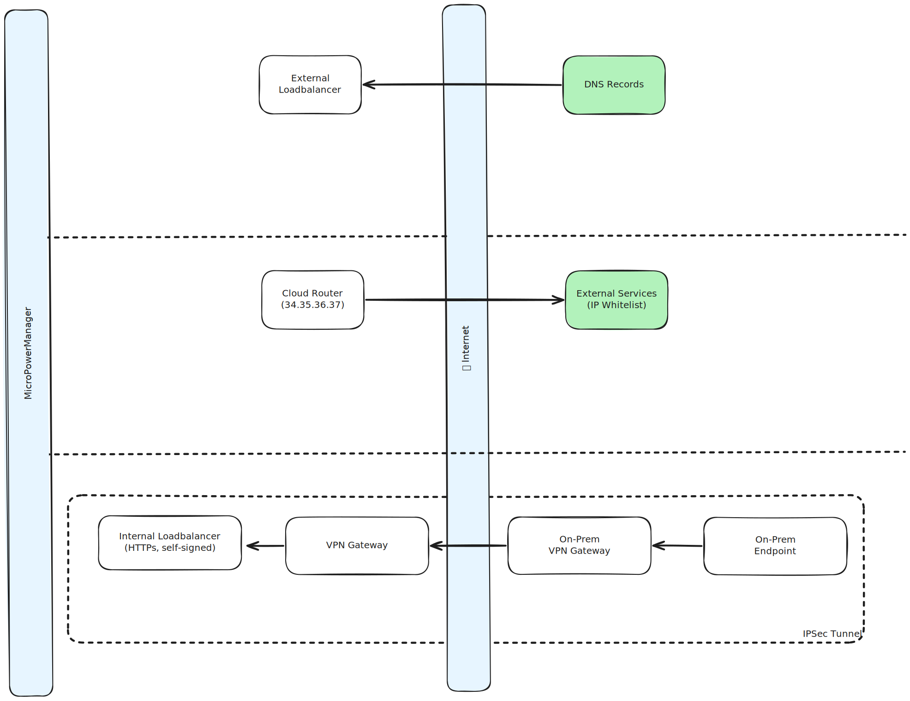

# Network considerations and topology

**External Loadbalancer:**

The external loadbalancer is the most basic (and arguably important) piece of the network.
It implements a consistent interface to incomming traffic from the outside world.

It is generally recommend to assign it a static IP.
This is IP is what is registered in DNS Records (A-Records).

It is the first touch point for all third party initiated traffic.
Hence it is accessed by

- Users
- Incomming Webhooks
- Any sort of Rest API based communication

**Cloud Router:**

The internals of a Coud setup might be quite complex.

As result, by default, outgoing traffic might not have transparent IP address.

Most of the time this is not a problem at all.

However, some third party services might rely on IP-Whitelisting.

This applies to MPM-initiated communication.
For example sending emails via a third party service.

\*\*
