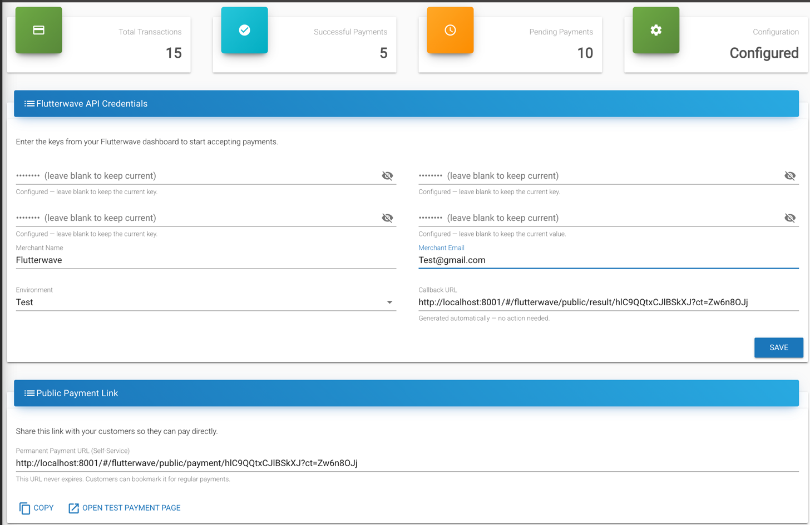
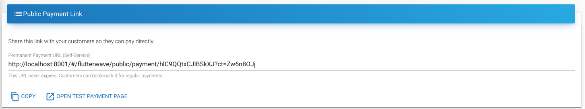

  

# Flutterwave Payment Provider

This guide provides step-by-step instructions for integrating [Flutterwave](https://flutterwave.com/) with your MicroPowerManager (MPM) project to accept online payments from customers for meter tokens and solar home system (SHS) services.

With Flutterwave enabled, MPM generates a public payment URL that you can share with customers.
Customers visit the link, select their device, enter an amount, and pay via Flutterwave's hosted checkout — the transaction is automatically recorded in MPM.

## Overview

### Pre-requisites

1. Access to the MPM admin panel
2. A [Flutterwave merchant account](https://dashboard.flutterwave.com/signup) (the sandbox/test mode is sufficient for initial setup)
3. Your Flutterwave **Public Key**, **Secret Key**, and **Encryption Key** from **Settings** → **API** in the [Flutterwave Dashboard](https://dashboard.flutterwave.com)
4. A **Secret Hash** — a value you choose yourself and set in both MPM and your Flutterwave dashboard (details in Step 4)

### Integration

1. Enable the `Flutterwave Payment Provider` plugin in MPM
2. Enter your API keys, a Secret Hash of your choosing, and merchant details on the overview page
3. Register MPM's webhook URL and the same Secret Hash in your Flutterwave dashboard — this step is manual, unlike some other providers
4. Share the generated payment URL with your customers

> [!INFO]
> You can start with Flutterwave **Test** credentials to verify the integration before switching to **Live** keys for production.

> [!WARNING]
> Flutterwave does not sign webhooks with your Secret Key.
> It echoes back whatever **Secret Hash** you configure in **Settings → Webhooks** on their dashboard, and MPM checks that it matches what you entered in Step 4 below.
> If you skip setting the Secret Hash on Flutterwave's side, Flutterwave sends webhook notifications with no verification header at all, and MPM will reject every one of them — payments will appear successful to the customer but never get confirmed in MPM.

## Detailed Setup

### Step 1: Create a Flutterwave Account

1. Visit [Flutterwave Signup](https://dashboard.flutterwave.com/signup)
2. Fill in your business details and verify your email
3. Complete the onboarding steps in the Flutterwave dashboard

### Step 2: Get Your API Keys

1. Log into your Flutterwave dashboard
2. Navigate to **Settings** → **API keys**
3. Copy your **Public Key**, **Secret Key**, and **Encryption Key**
   - Use the **Test** key set while setting up; switch to **Live** keys when ready for production

> [!WARNING]
> Keep your Secret Key and Encryption Key confidential. Never share them publicly or commit them to version control.

### Step 3: Enable the Flutterwave Plugin in MPM

1. Log into your MPM admin panel
2. Navigate to the **Plugin** page
3. Find **Flutterwave Payment Provider** in the available plugins list
4. Click **Enable** to activate the plugin
5. The setup wizard will appear — you can configure credentials now or skip and do it later from the overview page

### Step 4: Configure Credentials

1. Navigate to **Flutterwave** → **Overview** in the MPM sidebar
2. Fill in the credential form:
   - **Public Key** — your Flutterwave public key from Step 2
   - **Secret Key** — your Flutterwave secret key from Step 2
   - **Encryption Key** — your Flutterwave encryption key from Step 2
   - **Webhook Secret Hash** — pick any secret string yourself; this isn't provided by Flutterwave, you choose it. You'll set this exact same value on Flutterwave's side in Step 5.
   - **Merchant Name** — your business or mini-grid name
   - **Merchant Email** — the email associated with your Flutterwave account
   - **Environment** — select `Test` for the sandbox or `Live` for production
   - **Callback URL** — read-only and auto-generated; MPM derives it from the public payment URL, so you don't need to fill or copy anything by hand
3. Click **Save**
4. The Configuration status box at the top should turn green and show "Configured" once all four keys are set.

Every one of these four fields is **write-only**: once saved, MPM never displays the stored value back to you (even in encrypted form) — the field simply shows a "Configured" note and stays blank.
To change a key later, type the new value; leaving a field blank on save always means "keep what's already stored," so you never need to re-enter keys you aren't changing.

### Step 5: Register the Webhook in Flutterwave

Unlike some providers, Flutterwave requires you to register the webhook URL and Secret Hash by hand — there is no automatic registration call.

1. In MPM, on the **Flutterwave** → **Overview** page, find the **Flutterwave Webhook Link** card and copy the **Webhook URL**
2. Log into your Flutterwave dashboard and navigate to **Settings** → **Webhooks**
3. Paste MPM's webhook URL into the **Webhook URL** field for the environment you're using (Test or Live)
4. Set the **Secret Hash** field to the *exact same value* you entered as "Webhook Secret Hash" in Step 4 — a mismatch here means every webhook will be silently rejected
5. Save the webhook settings on Flutterwave's side

> [!INFO]
> Flutterwave's sandbox servers need your MPM instance to be reachable from the public internet.
> If you're testing locally, expose your backend with a tunnel (e.g. `ngrok http 8000`) and use the tunnel's public URL as the webhook URL for this step — a bare `localhost` address will never receive a webhook call.

### Step 6: Share the Payment URL with Customers

1. In the MPM Flutterwave overview page, find the **Public Payment Link** card and copy the **Permanent Payment URL**
2. Share this URL with your customers through:
   - SMS messages
   - Printed QR codes at your office
   - WhatsApp or other messaging apps
   - Your website or customer portal

When customers visit the payment URL, they will:

1. Select their device type (Meter or Solar Home System)
2. Enter their device serial number (validated against your MPM records as they type)
3. Enter the payment amount and select a currency
4. Complete payment through Flutterwave's secure hosted checkout
5. See a confirmation page with their transaction status

### Step 7: Test a Payment

Before going live, verify the integration works end-to-end:

1. Ensure your environment is set to **Test** in MPM credentials, and that the Test webhook is configured on Flutterwave's side (Step 5)
2. On the Flutterwave overview page, click **Open test payment page** to open the public payment form
3. Select a device type and enter a valid serial number from your MPM system
4. Enter a test amount and submit
5. Complete the payment using [Flutterwave's test card details](https://developer.flutterwave.com/docs/integration-guides/testing-helpers)
6. After payment, you'll be redirected to a result page — this page displays a live status check against Flutterwave, but the transaction is only actually marked complete in MPM once the webhook from Step 5 arrives, typically within a few seconds
7. Back in MPM, navigate to **Flutterwave** → **Transactions** to verify the transaction shows as **Success**, with an external transaction id populated

## How It Works

Flutterwave's v3 REST API drives the payment flow, and the redirect and the webhook are two independent paths:

1. **Initiate** — MPM calls `POST /v3/payments` with the amount and a reference it generates.
   Flutterwave returns a hosted checkout `link`.
2. **Customer Pays** — the customer's browser is redirected to that link and completes payment on Flutterwave's hosted page.
3. **Redirect (display only)** — Flutterwave redirects the customer back to MPM's result page with a reference and Flutterwave's own transaction id.
   MPM calls `GET /v3/transactions/{id}/verify` to show the customer a live status, but **this call does not update the transaction record** — it's purely for what the customer sees on screen.
4. **Webhook (authoritative)** — separately, Flutterwave's servers call MPM's webhook URL with the payment result.
   MPM verifies the request by comparing Flutterwave's `verif-hash` header against your configured Secret Hash, then updates the transaction and triggers token generation.
   **This is the only path that actually completes a payment in MPM** — if it never arrives (unregistered webhook, Secret Hash mismatch, MPM unreachable from the internet), the customer sees a success screen but the transaction stays at "Requested" indefinitely.

## Monitoring Transactions

The Flutterwave overview page in MPM shows:

- **Total Transactions** — all payment attempts
- **Successful Payments** — completed and verified transactions
- **Pending Payments** — transactions awaiting webhook confirmation
- **Configuration** — whether all four credential fields are set

For detailed transaction history, navigate to **Flutterwave** → **Transactions** to view, filter, and inspect individual payment records.

## Troubleshooting

- **Payment form shows "Invalid device serial number":**
  - Verify the serial number exists in your MPM system under the correct device type (Meter or SHS)
  - Check that the device is registered and active

- **Transaction stays at "Requested" even though the customer says they paid:**
  - This is almost always a webhook problem, not a payment problem — check Step 5 was completed on Flutterwave's side
  - Confirm the Secret Hash in Flutterwave's dashboard exactly matches the Webhook Secret Hash saved in MPM (retype both if unsure — there's no way to compare the stored value directly, since it's write-only)
  - Confirm the Webhook URL registered in Flutterwave points at a publicly reachable address for your MPM instance
  - Check MPM logs for webhook activity (`docker compose logs -f backend-dev`) — a rejected webhook logs as a `401` response

- **Customer sees "Success" on the result page, but nothing changes in MPM:**
  - This is the redirect-vs-webhook split described in "How It Works" above — the result page's status check doesn't write to MPM. Fix the webhook, not the redirect.

- **Saving credentials fails with a validation error:**
  - `Callback URL`, `Merchant Name`, `Merchant Email`, and `Environment` are always required
  - The four key fields are optional on each save (blank means "keep the current value"), but all four must have been set at least once before the plugin is usable

- **Authentication errors when initiating a payment:**
  - Double-check that you copied the full keys without extra spaces
  - Test keys only work with `Environment: Test`, and live keys only work with `Environment: Live`

## Production Considerations

When moving from test to production:

1. Switch your keys to **Live** in both MPM and the Flutterwave dashboard
2. Change the environment setting to **Live** in MPM credentials
3. Repeat Step 5 for the Live environment specifically — Flutterwave's Test and Live webhook settings are configured separately, so a webhook and Secret Hash registered only for Test won't carry over
4. Test a real payment with a small amount to confirm everything works
5. Monitor the first few transactions in both MPM and the Flutterwave dashboard
6. Ensure your MPM instance uses HTTPS — Flutterwave requires secure connections for live payments and webhooks

## References

- [Flutterwave Developer Docs](https://developer.flutterwave.com/docs)
- [Flutterwave Standard Payments (Hosted Checkout)](https://developer.flutterwave.com/docs/introduction-1)
- [Flutterwave Webhooks Guide](https://developer.flutterwave.com/docs/webhooks)
- [Flutterwave Test Cards / Sandbox Helpers](https://developer.flutterwave.com/v2.0/docs/test-cards)
