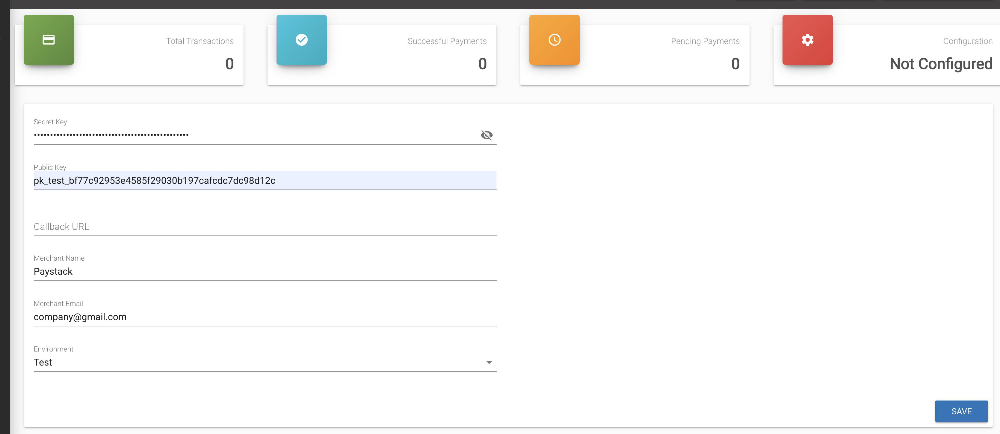
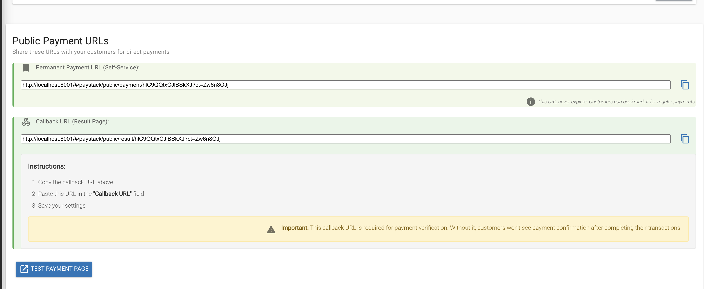

  

# Paystack Payment Provider

This guide provides step-by-step instructions for integrating [Paystack](https://paystack.com/) with your MicroPowerManager (MPM) project to accept online payments from customers for meter tokens and solar home system (SHS) services.

With Paystack enabled, MPM generates a public payment URL that you can share with customers. Customers visit the link, select their device, enter an amount, and pay via Paystack — the transaction is automatically recorded in MPM.

## Overview

### Pre-requisites

1. Access to the MPM admin panel
2. A [Paystack account](https://dashboard.paystack.com/#/signup) (a free test account is sufficient for initial setup)
3. Your Paystack **Secret Key** and **Public Key** from **Settings** → **API Keys & Webhooks** in the [Paystack Dashboard](https://dashboard.paystack.com)

### Integration

1. Enable the `Paystack Payment Provider` plugin in MPM
2. Enter your API keys and merchant details on the overview page
3. Copy the callback URL from MPM into your Paystack dashboard
4. Share the generated payment URL with your customers

> [!INFO]
> You can start with Paystack **Test** credentials to verify the integration before switching to **Live** keys for production.

## Detailed Setup

### Step 1: Create a Paystack Account

1. Visit [Paystack Signup](https://dashboard.paystack.com/#/signup)
2. Fill in your business details and verify your email
3. Complete the onboarding steps in the Paystack dashboard

### Step 2: Get Your API Keys

1. Log into your [Paystack Dashboard](https://dashboard.paystack.com)
2. Navigate to **Settings** → **API Keys & Webhooks**
3. Copy your **Secret Key** and **Public Key**
   - Use **Test** keys while setting up; switch to **Live** keys when ready for production

> [!WARNING]
> Keep your Secret Key confidential. Never share it publicly or commit it to version control.

### Step 3: Enable the Paystack Plugin in MPM

1. Log into your MPM admin panel
2. Navigate to the **Plugin** page
3. Find **Paystack Payment Provider** in the available plugins list
4. Click **Enable** to activate the plugin
5. The setup wizard will appear — you can configure credentials now or skip and do it later from the overview page

### Step 4: Configure Credentials

1. Navigate to **Paystack** → **Overview** in the MPM sidebar
2. Fill in the credential form:
   - **Secret Key** — your Paystack secret key from Step 2
   - **Public Key** — your Paystack public key from Step 2
   - **Callback URL** — leave as default (MPM sets this automatically)
   - **Merchant Name** — your business or mini-grid name
   - **Merchant Email** — the email associated with your Paystack account
   - **Environment** — select `Test` for testing or `Live` for production
3. Click **Save**
4. The Configuration status box at the top should turn green and show "Configured"

### Step 5: Set Up the Callback URL in Paystack

The callback URL tells Paystack where to redirect customers after payment. MPM generates this for you automatically.

1. In the MPM Paystack overview page, scroll down to **Public Payment URLs**
2. Copy the **Callback URL (Result Page)**
3. Go to your [Paystack Dashboard](https://dashboard.paystack.com) → **Settings** → **API Keys & Webhooks**
4. Paste the copied URL into the **Callback URL** field
5. Save your settings

> [!WARNING]
> Without the callback URL, customers won't see a payment confirmation page after completing their transaction.

### Step 6: Share the Payment URL with Customers

1. In the MPM Paystack overview page, copy the **Permanent Payment URL**
2. Share this URL with your customers through:
   - SMS messages
   - Printed QR codes at your mini-grid office
   - WhatsApp or other messaging apps
   - Your website or customer portal

When customers visit the payment URL, they will:

1. Select their device type (Meter or Solar Home System)
2. Enter their device serial number (validated against your MPM records)
3. Enter the payment amount
4. Complete payment through Paystack's secure checkout
5. See a confirmation page with their transaction status

### Step 7: Test a Payment

Before going live, verify the integration works end-to-end:

1. Ensure your environment is set to **Test** in MPM credentials
2. On the Paystack overview page, click **Test Payment Page** to open the public payment form
3. Select a device type and enter a valid serial number from your MPM system
4. Enter a test amount and submit
5. Complete the payment using [Paystack's test card details](https://paystack.com/docs/payments/test-payments/)
6. After payment, you should be redirected to the result page showing the transaction status
7. Back in MPM, navigate to **Paystack** → **Transactions** to verify the transaction was recorded

## Monitoring Transactions

The Paystack overview page in MPM shows:

- **Total Transactions** — all payment attempts
- **Successful Payments** — completed and verified transactions
- **Pending Payments** — transactions awaiting verification
- **Configuration** — current credential status

For detailed transaction history, navigate to **Paystack** → **Transactions** to view, filter, and inspect individual payment records.

## Troubleshooting

- **Payment form shows "Invalid device serial number":**
  - Verify the serial number exists in your MPM system under the correct device type (Meter or SHS)
  - Check that the device is registered and active

- **Customer not redirected after payment:**
  - Verify the callback URL is correctly set in your Paystack dashboard (Step 5)
  - Ensure your MPM instance is publicly accessible (not just on localhost)

- **Transaction not appearing in MPM:**
  - Check that your API keys match between MPM and Paystack dashboard
  - Verify the environment setting (Test vs Live) matches the keys you're using
  - Check MPM logs for webhook processing errors

- **"Failed to generate public URLs" error:**
  - Save your credentials first — URLs can only be generated after credentials are configured
  - Refresh the page and try again

- **Authentication errors:**
  - Double-check that you copied the full API keys without extra spaces
  - Ensure you're using the correct key pair (Test keys for test environment, Live keys for live)

## Production Considerations

When moving from test to production:

1. Switch your API keys to **Live** keys in both MPM and Paystack dashboard
2. Change the environment setting to **Live** in MPM credentials
3. Update the callback URL if your production domain differs from your test setup
4. Test a real payment with a small amount to confirm everything works
5. Monitor the first few transactions in both MPM and Paystack dashboards
6. Ensure your MPM instance uses HTTPS — Paystack requires secure connections for live payments

## References

- [Paystack Dashboard](https://dashboard.paystack.com)
- [Paystack API Documentation](https://paystack.com/docs/api/)
- [Paystack Test Payments Guide](https://paystack.com/docs/payments/test-payments/)
- [Paystack Webhooks](https://paystack.com/docs/payments/webhooks/)
