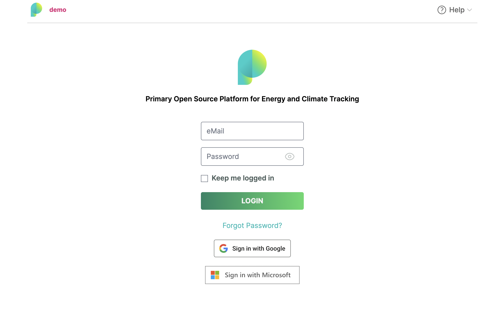
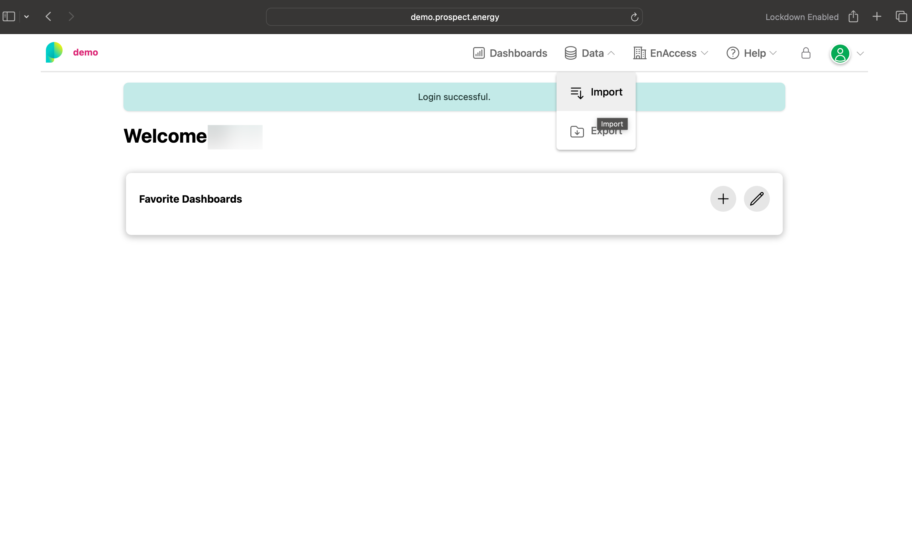
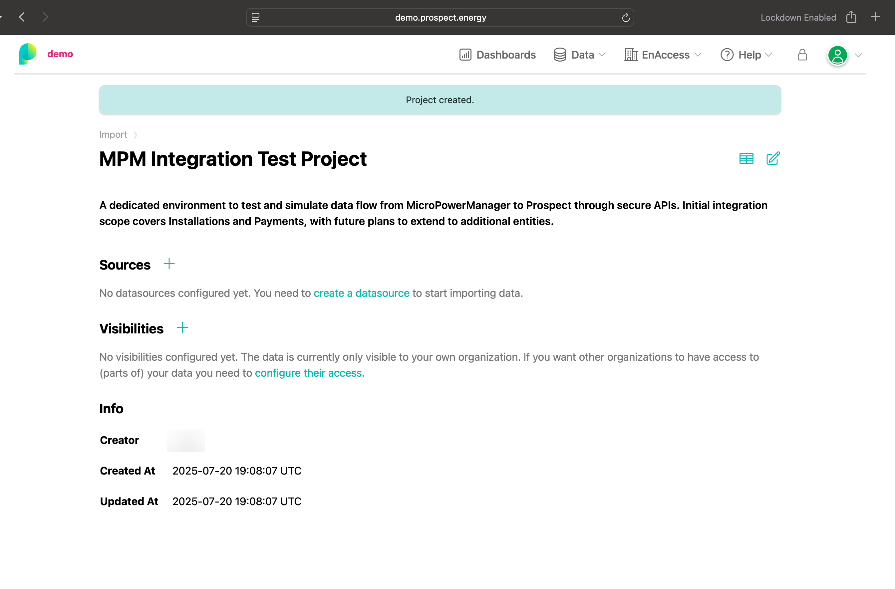
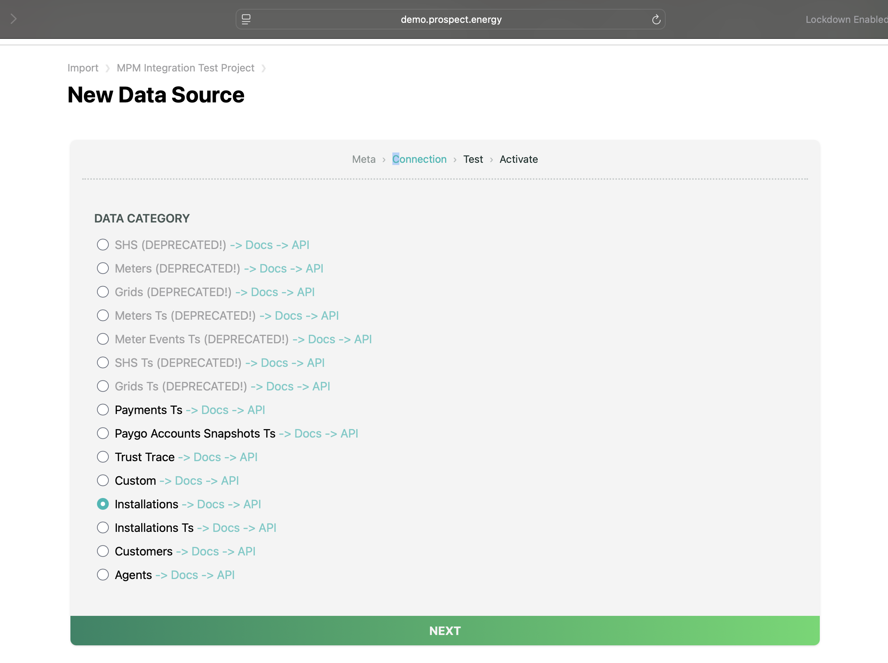
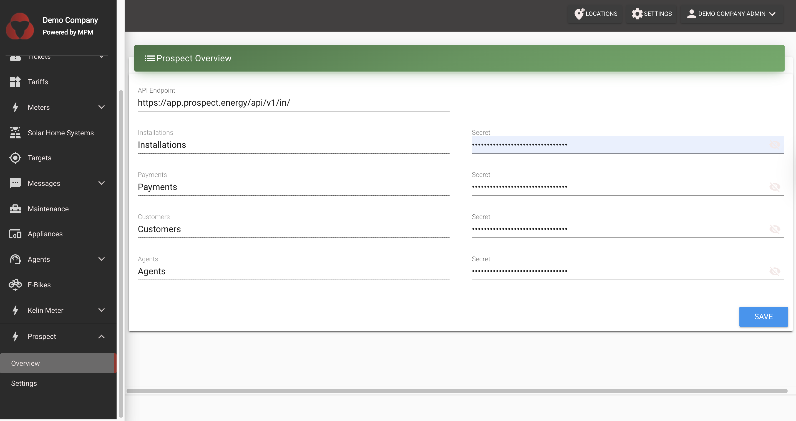
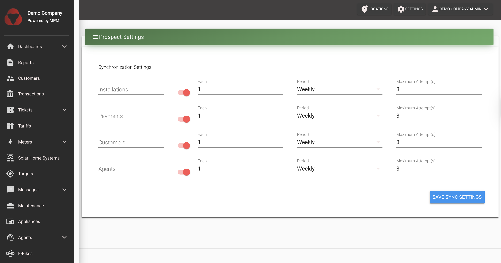

# Prospect Integration

This guide provides step-by-step instructions for setting up and integrating Prospect with your MicroPowerManager project for data analytics and monitoring.

## Overview

Prospect is a data analytics platform that allows you to import, analyze, and visualize data from your energy systems. This integration enables you to push multiple types of data to Prospect for comprehensive reporting and analysis:

- **Installations**: Device installation (SHS, MiniGrid, Meter) data
- **Payments**: Payment transaction history and financial records
- **Agents**: Agents' information
- **Customers**: Customer profile and demographic data

Each data type can be independently configured with custom sync schedules and can be enabled or disabled as needed, giving you full control over what data is synchronized and when.

## Prerequisites

- Access to Prospect demo platform
- Valid login credentials for Prospect
- MicroPowerManager instance with installation data to export
- Appropriate permissions to configure plugins in MicroPowerManager

## Getting Started

### Step 1: Access Prospect Platform

1. Registrations are done on request to the Prospect team, who will provide the login details to access the platform.
2. Navigate to the Prospect platform: [https://app.prospect.energy/](https://app.prospect.energy/)
3. Login using your provided email and password credentials

### Step 2: Navigate to Data Import

1. After successful login, you'll land on the main dashboard
2. Navigate to the **Data** section in the main menu
3. Select **Import** from the dropdown options

## Project Setup

### Step 3: Create a New Project

1. You'll see a page listing all existing projects with an option to create a new one
1. Click the **"NEW PROJECT"** button to start creating a project

1. Provide the following information:
   - **Project Name**: Enter a descriptive name for your project
   - **Description**: Add relevant details about the project scope

1. Click **Create** to proceed

### Step 4: Configure Data Source

After project creation, you'll be redirected to the project page where you can configure your data sources.

1. Click on the **"Create Datasource"** link to begin configuration

## Data Source Configuration

### Step 5: Select API Push Data Source

1. Choose **API Push** from the available data source options
2. You'll find this under the **"Other"** category in the datasources list
3. Provide a descriptive name like `Test API Push Import`
4. Click **Next** to continue

### Step 6: Choose Connection Type

Select the appropriate connection type based on the data you want to sync:

- **Installations** - For device installation data
- **Agents** - For agent information
- **Customers** - For customer profiles
- **Payments** - For payment transaction data

You can create multiple data sources for different connection types. For this guide, we'll start with **Installations**, but you can repeat this process for each data type you want to sync.

### Step 7: API Configuration Details

After selecting your connection type, you'll see the API configuration page with:

- **API Endpoint**: The URL where you'll POST your data
- **Documentation Link**: Access to full API documentation
- **Authorization Details**: Bearer token for authentication

This page displays the key information you'll need to configure the integration, including the POST URL endpoint for sending data, the authorization bearer token required for API authentication, and a link to the complete API documentation.

### Step 8: Activate Data Source

1. Click **Next** to proceed to activation
1. Check the activation checkbox to enable the data source
1. Review the data source configuration:
   - **State**: Active/Inactive status
   - **Data Category**: installations
   - **Organization**: Your organization details
   - **Secret**: API authentication token

## Configuring the MPM Integration

Now that you have obtained the authorization token and API endpoint from Prospect, you need to configure the Prospect plugin in MicroPowerManager.

### Step 9: Enable Prospect Plugin

1. Log in to your MicroPowerManager instance
2. Navigate to **Settings** → **Configuration** → **Plugins**
3. Locate the **Prospect** plugin
4. Enable the plugin by toggling the switch to the "On" position

### Step 10: Configure Plugin Settings

After enabling the plugin, you need to configure it with the credentials obtained from Prospect:

1. Navigate to the **Overview** page (this is typically in the Prospect plugin section)
2. Enter the **Authorization Token** that you obtained from Step 8 of the Prospect platform
3. Specify the **BASE_URL** - this should be the API endpoint URL shown in Step 7 (e.g., `https://app.prospect.energy/api/v1/in/`)
4. Click **Save** to store your configuration

**Note**: The BASE_URL should be the base API endpoint. The system will automatically append the appropriate endpoint path for each data type (installations, payments, agents, customers) when syncing.

### Step 11: Configure Synchronization Settings

The Prospect plugin supports syncing multiple data types: **Installations**, **Payments**, **Agents**, and **Customers**. You can configure each data type independently.

1. Navigate to the **Settings** page within the Prospect plugin
2. You'll see a list of all available data types with their current sync settings
3. For each data type, you can configure:
   - **Enable/Disable Sync**: Toggle the switch to enable or disable syncing for that specific data type
   - **Sync Frequency**: Set how often to sync:
     - **Hourly** - Syncs data every hour
     - **Daily** - Syncs data once per day
     - **Weekly** - Syncs data once per week
     - **Monthly** - Syncs data once per month
   - **Sync Interval**: Specify the number of periods (e.g., "Every 2 days", "Every 3 weeks")
   - **Maximum Attempts**: Set the maximum number of retry attempts if a sync fails
4. Configure each data type according to your needs
5. Click **Save Sync Settings** to apply your configuration

**Important Notes**:

- Each data type can be enabled or disabled independently
- When a data type is disabled, it will not be synced
- Disabled sync settings will have their configuration fields grayed out
- You can change these settings at any time without affecting already synced data

## How It Works

Once configured, the Prospect plugin will automatically synchronize your data to Prospect. The sync process works differently for each data type:

### Data Synchronization Process

For each enabled data type, the system follows this process:

1. **Data Extraction**: The system extracts relevant data from your MPM database
   - **Installations**: Extracts device installation data including device information and location data
   - **Payments**: Extracts payment transaction history including payment amounts, dates, payment methods, and related information
   - **Agents**: Extracts agent information including agent details, contact information, and location data
   - **Customers**: Extracts customer profile data including personal information, addresses, and citizenship details

2. **CSV File Generation**: The extracted data is formatted into CSV files with appropriate headers and structure

3. **Data Push**: The CSV data is sent to Prospect using the configured API endpoint and authentication token

4. **Scheduled Execution**: The sync runs automatically according to your configured schedule for each data type

### Sync Behavior

- **Independent Sync Control**: Each data type (Installations, Payments, Agents, Customers) can be enabled or disabled independently
- **Automatic Scheduling**: The system checks which data types need syncing based on their individual schedules and enabled status
- **Error Handling**: If a sync fails, the system will retry up to the configured maximum attempts
- **No Manual Intervention**: Once configured, the integration handles all synchronization automatically

### Data Type Details

#### Installations Sync

- Syncs device installation records
- Includes device information and related data
- Useful for tracking all installations of your devices

#### Payments Sync

- Syncs payment transaction history
- Includes payment amounts, dates, payment methods, and transaction details
- Useful for financial reporting and revenue analysis

#### Agents Sync

- Syncs agent information
- Includes agent details, contact information, and geographic data
- Useful for managing agent networks and performance tracking

#### Customers Sync

- Syncs customer profile information
- Includes personal details, addresses, and country information
- Useful for customer management and demographic analysis

## Project Management

### Viewing Projects and Data Sources

1. Return to the projects list to see all configured projects
2. Click on any project to view its associated data sources
3. Monitor data source status and manage configurations as needed

## Managing Sync Settings

### Enabling/Disabling Data Sync

You can enable or disable syncing for any data type at any time:

1. Navigate to **Settings** → **Configuration** → **Plugins** → **Prospect** → **Settings**
2. Find the data type you want to modify (Installations, Payments, Agents, or Customers)
3. Toggle the **Enable/Disable** switch for that data type
4. Click **Save Sync Settings**

**When Disabled**:

- The data type will not be synced
- Configuration fields for that data type will be disabled (grayed out)
- Previously synced data in Prospect will remain unchanged

**When Enabled**:

- The data type will be synced according to its configured schedule
- The next sync will occur based on the last successful sync time and the configured interval

### Changing Sync Frequency

To change how often a data type syncs:

1. Navigate to the Prospect plugin **Settings** page
2. For the data type you want to modify:
   - Adjust the **Each** field (number of periods)
   - Select the **Period** (Hourly, Daily, Weekly, Monthly)
3. Click **Save Sync Settings**

The system will calculate the next sync time based on your new settings and the last successful sync.

## Troubleshooting

### Common Issues

1. **Plugin Not Syncing Data**
   - Verify that the Prospect plugin is enabled in MPM settings
   - Check that the API token and BASE_URL are correctly configured
   - Ensure the token hasn't expired
   - Verify network connectivity between MPM and Prospect
   - **Check that the specific data type is enabled** in the sync settings

2. **Data Not Appearing in Prospect**
   - Check MPM logs for any sync errors
   - Verify that there is data available in your MPM database for the specific data type
   - Confirm that the data type is enabled in sync settings
   - Verify that the schedule is correctly configured and the sync has run
   - Check Prospect platform for any incoming data errors
   - Ensure you've created the corresponding data source in Prospect for that data type

3. **Configuration Issues**
   - Ensure the BASE_URL matches the API endpoint from your Prospect datasource
   - Verify the authorization token is correct and up-to-date
   - Check that you have appropriate permissions to configure plugins
   - Verify that each data type you want to sync has a corresponding data source configured in Prospect

4. **Specific Data Type Not Syncing**
   - Check if that data type is enabled in the sync settings
   - Verify that there is data available in your MPM database for that type
   - Check MPM logs for specific errors related to that data type
   - Ensure the corresponding data source is active in Prospect

### Checking Sync Status

You can monitor the sync status by:

1. Checking MPM logs for Prospect-related entries
2. Verifying data appears in your Prospect project dashboard

### API Documentation

For complete API reference and additional endpoints, visit:
`https://app.prospect.energy/api-docs/index.html`

## Next Steps

1. **Configure Multiple Data Sources**: Create data sources in Prospect for each data type you want to sync (Installations, Payments, Agents, Customers)

2. **Enable Desired Data Types**: In the MPM Prospect plugin settings, enable the data types you want to sync and configure their schedules

3. **Monitor Sync Status**:
   - Check MPM logs for sync activity and any errors
   - Verify data appears in your Prospect project dashboards
   - Monitor sync success rates for each data type

4. **Verify Data**: Use the Prospect platform to verify that your data appears correctly:
   - Check installation data for device tracking
   - Review payment data for financial reporting
   - Validate agent information for network management
   - Confirm customer data for demographic analysis

5. **Optimize Sync Schedules**: Adjust sync frequencies based on your needs:
   - More frequent syncs for real-time reporting
   - Less frequent syncs to reduce system load
   - Different schedules for different data types based on update frequency

6. **Analytics Setup**: Configure dashboards and reports in the Prospect platform to analyze your synced data

7. **Regular Maintenance**: Periodically review sync settings and ensure all data types are syncing successfully

## Support

For technical support or questions regarding Prospect integration:

- Review the API documentation
- Check the Prospect platform help resources
- Contact the Prospect team for access-related issues

## Summary

The Prospect integration provides comprehensive data synchronization capabilities for your MicroPowerManager system. You can sync:

- **Installations**: Device installation and deployment data
- **Payments**: Payment transaction history and financial data
- **Agents**: Agent/merchant network information
- **Customers**: Customer profile and demographic data

Each data type can be independently configured with its own sync schedule and can be enabled or disabled as needed. This flexibility allows you to customize the integration to match your specific reporting and analytics requirements.

---

This integration enables comprehensive tracking and analysis of your energy system operations, providing valuable insights for business operations, customer management, financial reporting, and network performance.
