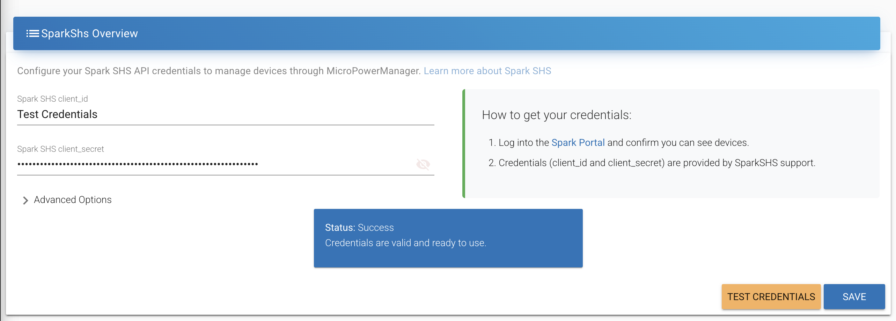

  

# Spark SHS integration

This guide provides step-by-step instructions integrating [Spark](https://sparkenergy.io/) Solar Home Systems with your MicroPowerManager project.

  

## Overview

### Pre-requisites

1. Log into the [Spark Portal](https://platform.ruralspark.com/signin) and confirm you can see devices.
2. Credentials (`client_id` and `client_secret`) are provided by SparkSHS support.

### Integration

1. Enable `SparkShs` plugin for MicroPowerManager
2. Enter credentials as `client_id` and `client_secret`
3. Click `Test Credentials`, then `Save` if successful

   

> [!INFO]
> It possible to customise the Spark SHS backend and auth URL's.
> For example to point to Staging environment.
> Under normal circumstances this isn't required and the default values will be correct.

## References

- [Spark Portal](https://platform.ruralspark.com/welcome)
- [Spark Platform API Docs](https://sparkenergy.stoplight.io/)
- [Spark Support Platform](https://sparkenergy.atlassian.net/wiki/spaces/SS/overview)
