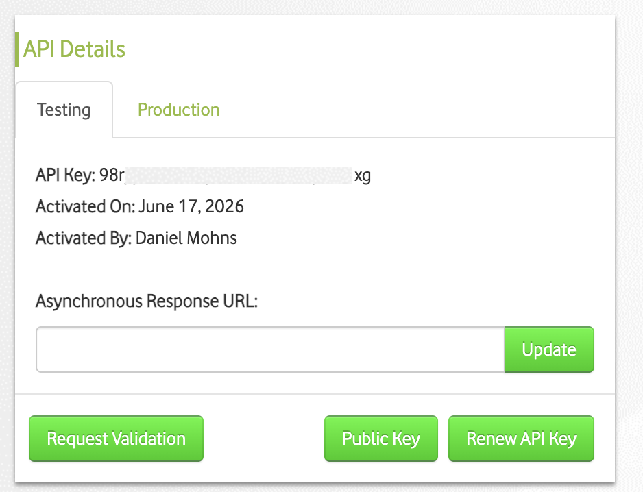
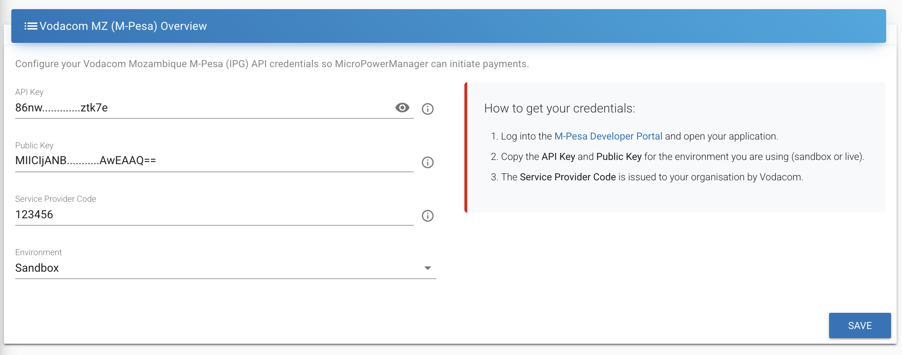

  

# Vodacom MZ / M-Pesa

[Vodacom MZ/M-Pesa](https://www.vm.co.mz/m-pesa) offers two distinct APIs for interacting with transactions:

- M-Pesa OpenAPI (MPM-initiated transactions)
- M-Pesa Generic C2B API (customer-initiated transactions)

## M-Pesa OpenAPI (MPM-initiated transactions)

The OpenAPI integration must be validated by Vodacom before it can be used in production.

Validation requires exercising a "handful" of transactions in the test/UAT environment.

"Handful" is not precisely defined, but in practice 5 transactions less than 14 days old have sufficed.

### Onboarding to the test environment

- Create a [Developer Portal](https://developer.mpesa.vm.co.mz/) account — this grants immediate access to the test environment.
- Copy the API Key from the Profile section.
  
- Reveal the public key via the `Public Key` button and paste it into the field.
- Set the Service Provider Code if you already have one; otherwise use `171717` on the test environment.

### Usage

Generate a few transactions, ideally by creating a test SHS and selling it.

### Requesting validation

Click `Request Validation` to start generating live API keys.

> [!INFO]
> This is a manual process on Vodacom's side and can take a varying amount of time.
> During it, your Service Provider Code is linked to the live API keys.

## M-Pesa Generic C2B API (customer-initiated transactions)

### Onboarding

Onboarding for the Generic C2B API is a custom process with security implications.
A full implementation may require a VPN tunnel and certificate exchange.

The exact steps are T.B.D. and not supported in MPM by default.
