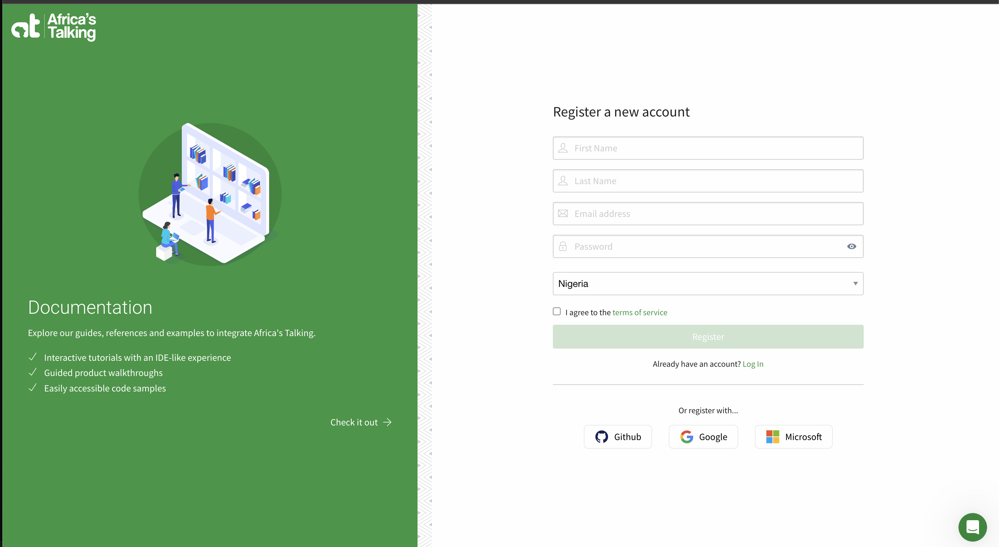
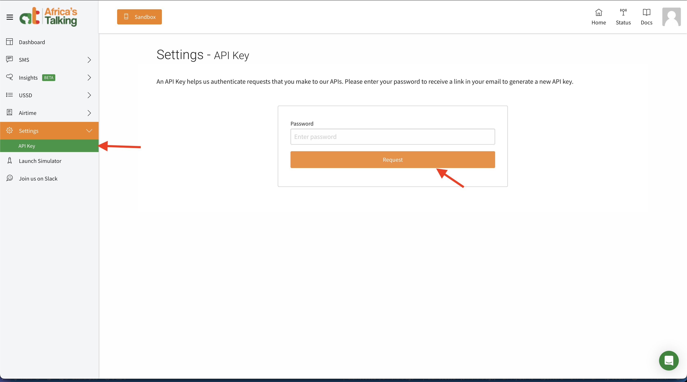
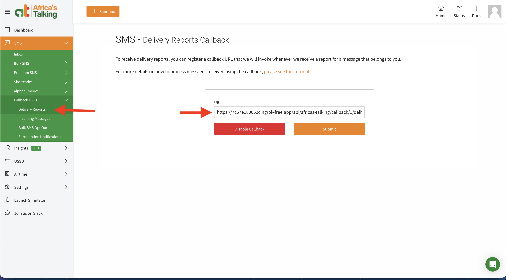

# AfricasTalking SMS Gateway Setup

This guide will walk you through the complete setup process for integrating AfricasTalking SMS service with MicroPowerManager (MPM) to enable SMS notifications and communications.

## Prerequisites

- Access to MPM admin panel
- AfricasTalking account (free sandbox account is sufficient for testing)
- Basic understanding of API integrations

## Step 1: Create AfricasTalking Account

1. Visit [AfricasTalking](https://account.africastalking.com/auth/register)
2. Fill in your details and verify your email address
3. Complete the account setup process



## Step 2: Generate API Key for Plugin

1. Log into your AfricasTalking dashboard
2. Navigate to **Settings** → **API Key**
3. Click **Request**
4. Copy the generated API key - you'll need this for MPM configuration



## Step 3: Set Up SMS Short Code

1. In your AfricasTalking dashboard, go to **SMS** → **Short Codes**
2. Request a short code for your application
3. Note down the assigned short code number
4. Configure the short code settings as needed for your use case


## Step 4: Enable AfricasTalking Plugin in MPM

1. Log into your MPM admin panel
2. Navigate to **Plugins** section
3. Find the **AfricasTalking** plugin in the available plugins list
4. Click **Enable** to activate the plugin
5. Confirm the activation


## Step 5: Configure AfricasTalking Credentials

1. After enabling the plugin, go to **Plugins** → **AfricasTalking** → **Settings**
2. Enter the following credentials:
   - **API Key**: Paste the API key generated in Step 2
   - **Short Code**: Enter the short code obtained in Step 3
   - **Username**: Your AfricasTalking username
3. Save the configuration
4. Test the connection to ensure credentials are valid


## Step 6: Register SMS Delivery Callback URL

1. In your AfricasTalking dashboard, go to **SMS** → **Callback URLs**
2. Set up the delivery callback URL to point to your MPM instance: Copy the url
   from the plugin overview page

   ```bash
   https://your-mpm-domain.com/api/africas-talking/callback/1/delivery-reports
   ```

3. Enable delivery reports to track SMS delivery status



## Step 7: Select AfricasTalking as Your SMS Gateway

1. Navigate to **Settings** → **Configuration** → **Main Settings**
2. Scroll to the **SMS Gateway** dropdown field
3. Select **Africa's Talking** from the list
4. Click **Save** to apply your selection

## Step 8: Test SMS Functionality

1. Navigate to **Customers** in your MPM dashboard
2. Select a customer to view their details
3. Ensure the customer Primary toggle is on i.e customer is a primary customer.
4. On the customer detail page, locate the **Send SMS** option
5. Compose a test message
6. Send the SMS to verify the integration is working
7. Check the delivery status in both MPM and AfricasTalking dashboard


## Troubleshooting

**Common Issues:**

- **SMS not sending**:
  - Verify API credentials and check if the plugin is properly enabled
  - Ensure AfricasTalking is selected in Main Settings
  - Check your AfricasTalking account balance
- **Delivery reports not updating**:
  - Ensure callback URL is correctly configured and accessible
  - Verify your MPM instance can receive incoming webhook requests
- **Authentication errors**:
  - Double-check API key and username in plugin settings
  - Verify you're using the correct environment (sandbox vs production)

**Verification Steps:**

1. Check MPM logs for any error messages
2. Verify SMS delivery in AfricasTalking dashboard
3. Test with different phone numbers to ensure compatibility
4. Confirm AfricasTalking is selected in Settings → Main Settings
5. Check delivery reports in AfricasTalking dashboard

## Production Considerations

When moving from sandbox to production:

1. Update API key to production environment in AfricasTalking
2. Update credentials in MPM plugin settings
3. Test thoroughly with real phone numbers
4. Monitor SMS delivery rates and costs
5. Set up proper error handling and logging
6. Configure billing alerts in AfricasTalking dashboard
7. Review and optimize your SMS templates for cost efficiency

## Why Choose AfricasTalking?

AfricasTalking is ideal if you:

- Need high-volume SMS delivery (1000+ messages/month)
- Require guaranteed delivery rates
- Need delivery reports and analytics
- Have budget for per-message costs
- Operate across multiple African countries
- Need 99.9% uptime and reliability
- Want access to additional features (USSD, Voice, Airtime)

For cost-effective, lower-volume messaging using your own Android device, consider [TextBee SMS Gateway](/usage-guide/textbee-setup).
