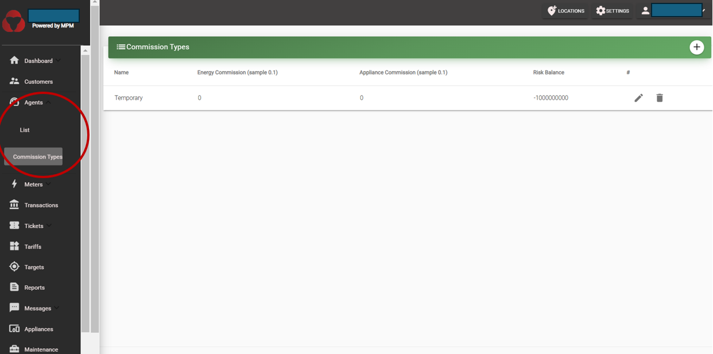
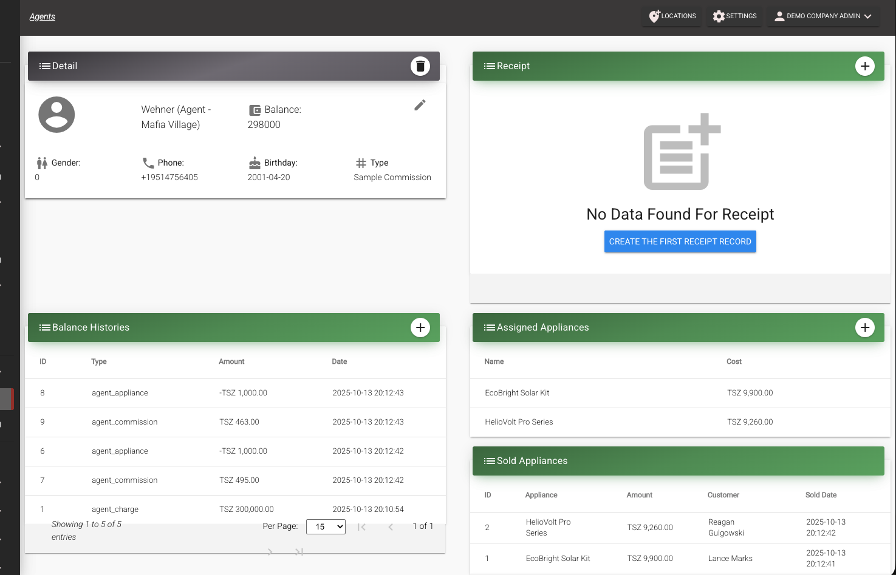

# Agents

Agents are company staff that are on site (or close to the site) and are able to support customers with tasks such as token generation (in exchange for cash payments), selling appliances, report customer issues to the company headquarters, etc.

Agents require the apps to do their work (see [Android apps](/usage-guide/android-apps)).

The user can register a new Agent on the MicroPowerManager account by going to the "Agents" menu and then pressing on ":heavy_plus_sign:".

The defined log in credentials by the user are then to be shared with the Agent, for them to be able to use the Agent account.
For more information on how to generate and manage tickets, see [Tickets](/usage-guide/tickets).

## Agent Commission Types

Agents receive cash from customers on site.
MicroPowerManager tracks three separate totals for every agent, all visible on the agent's profile card:

- **Balance**: the agent's running position.
  It goes negative as the agent sells on the company's behalf and positive when the company pre-loads credit or the agent settles up.
- **Commission**: the commission the agent has earned but not yet been credited.
  It accumulates with every sale and is kept strictly separate from the balance until a receipt is created.
- **Due to Company**: the cash the agent has collected on behalf of the company and still has to hand over.

The **risk balance** is the maximum amount of money that an agent can collect before it has to transfer the money to the company.
When that balance is reached, agents will not be able to collect money anymore (generate tokens) or sell appliances (their account on the app will not work).
So, when the agent hands the collected money to the company, headquarters records this through MicroPowerManager desktop.
This is done by creating a **receipt** on the specific agent’s profile.
When that receipt is created, the amount due to the company is cleared and the agent's earned commission is credited to their balance as an explicit **Payout** entry.

Agents are paid on a commission-basis.
There are 2 commission types:

- **Energy commission:** share of the energy transaction that is kept by the agent.
- **Appliance commission:** share of the appliance value that is kept by the agent.

Both values are stored as a **fraction between 0 and 1**, not as a percentage number.
So `0.1` means 10%, `0.05` means 5%, and `0.5` means 50%.

::: warning Do not enter a whole number
Entering `10` to mean "10%" is interpreted as 1000%, and `50` becomes 5000%.
This massively overstates the commission the agent keeps and corrupts the suggested receipt amount (see [Agent Receipts](#agent-receipts) below).
Always enter the rate as a fraction, for example `0.1` for 10%.
:::

### Putting it together: a worked example

It helps to follow the money through a single day.

Suppose an agent is on a commission type with a **10% energy commission** and a **risk balance of 10,000**.

A customer pays the agent **3,000** in cash for electricity, and the agent generates the token on the spot.
The agent has now collected 3,000 on behalf of the company, so their **Due to Company** rises to 3,000 and their balance drops to -3,000.
Out of that sale the agent earns **300** as commission (10% of 3,000), which appears in their **Commission** total and in the commission history as an **Earned** entry.
The commission does not reduce what is shown as due — the full 3,000 of collected cash stays visible until the agent settles up.

As the day goes on the agent keeps selling, and the amount due keeps climbing.
Once it reaches the **risk balance**, the app stops the agent from generating tokens or selling appliances until they settle up.
This protects the company: the agent is holding its cash, and the risk balance caps how much it is willing to have out in the field at any one time.

The agent then travels to headquarters and hands over cash.
A staff member creates a **receipt** on the agent's profile for the amount handed over.
The receipt credits the cash plus the agent's earned commission to their balance, clears the amount due, and records the commission credit as a **Payout** entry in the commission history.
If the agent kept their commission in cash (handing over 2,700 in the example), the commission credit covers the difference and the due still clears to zero.
Either way, the agent can start serving customers again.

## Assigning or changing the commission of an agent

1. Create a commission type under Agent --> Commission type (click on the ":heavy_plus_sign:" button at the top right corner).
2. You either create a new agent, or you go to the page of the specific agent for which you want to change the commission type.
3. If you create a new agent, you select the commission type you want form the drop box.
4. If you edit it from an existing agent, you go to the agent, press the "pencil" drawing  commission field, and select from the dropdown.

## Agent Transaction Entities

These records track money given to and returned by agents, keeping their balance up to date.

### Agent Charges

An **agent charge** represents money the company gives to the agent so that they can continue serving customers.
Charges are created from the agent's profile, via the ":heavy_plus_sign:" button on the **Balance Histories** panel.
When a charge is saved, a matching balance entry is added so the credit appears in the agent’s ledger.

### Agent Receipts

An **agent receipt** records money the agent hands back to the company.
This is how you "collect" an agent's outstanding balance from the web.
You create receipts from the agent profile (`Agents` → `Receipt` → `+`).

Receipts do the opposite of charges: they settle the debt the agent owes the company.
When a receipt is saved, the system will:

- record the cash amount plus the agent's pending commission as a single credit in the balance history,
- record the commission credit as an explicit **Payout** entry in the commission history,
- store a breakdown of the visit — the amount that was due, what was collected since the last visit, and the commission credited,
- and update the agent’s totals — the amount due to the company, the commission they’ve earned, and their current balance.

#### Understanding the receipt dialog

The receipt dialog shows three figures before you enter an amount:

- **Due to Company**: the full cash the agent has collected and not yet handed over.
- **Pending Commission**: the commission the agent has earned since their last receipt.
- **Total Balance Credit**: the amount you enter plus the pending commission — this is what will be credited to the agent's balance.

Enter the amount of cash the agent **actually hands over**.
If the agent kept their commission in cash, that is the amount due minus the pending commission — the system credits the commission automatically, so the due still clears to zero.
If the agent hands over the full amount due, their commission lands as positive balance instead.
The form rejects anything higher than the amount due.

#### When the amount due looks wrong

If the amount due looks far too high, the cause is almost always a **commission type that was set up with the wrong scale** — a whole number such as `10` or `50` instead of a fraction like `0.1` or `0.5` (see the warning under [Agent Commission Types](#agent-commission-types)).
An inflated commission rate distorts every commission figure derived from it.

To recover:

1. Fix the commission type so the rate is a fraction between 0 and 1.
2. Create a receipt to clear the agent's amount due back to zero.
   This resets the balance and the risk balance.
3. From then on, new transactions apply the corrected commission.

#### Receipt breakdown

The receipt list on the agent profile shows how each receipt was calculated: the cash amount handed in, the commission credited, what was due at the time of the visit, and how much sales activity happened since the last visit.

The agent profile shows two history panels:

- **Balance Histories** lists everything that moves the agent's balance — energy sales, appliance sales, balance charges, and receipts — with the current balance shown above the list.
- **Commission Histories** lists commission movements — **Earned** entries for each sale (with the transaction ID it came from) and **Payout** entries created by receipts — with the commission balance shown above the list.

Each ledger sums to its total, so you can reconcile both figures at a glance.
