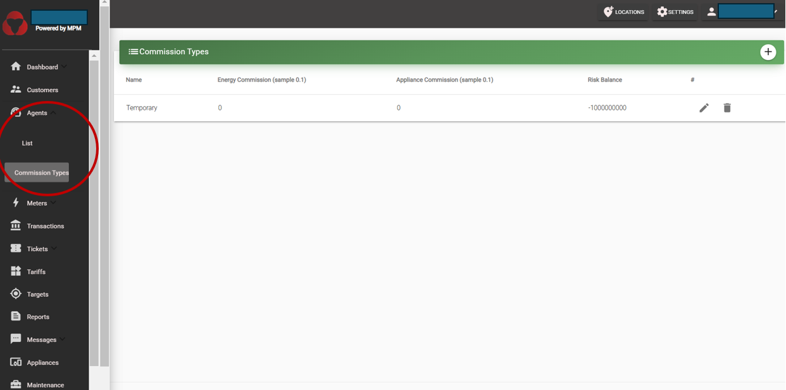
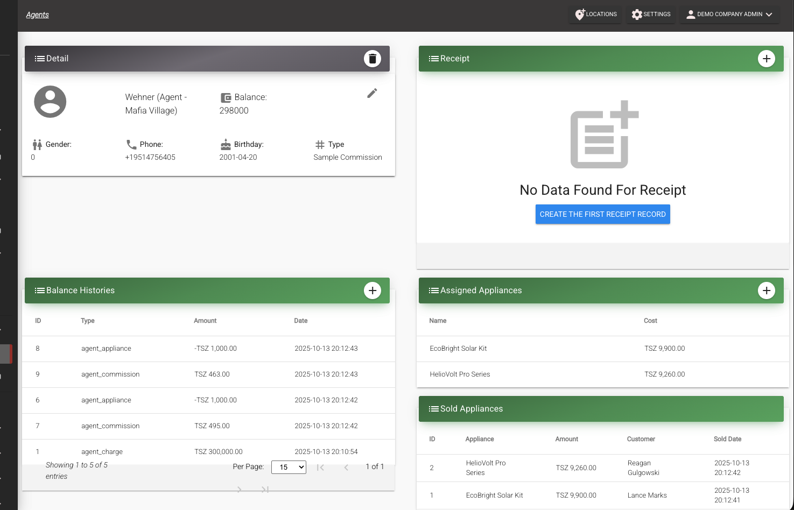

# Agents

Agents are company staff that are on site (or close to the site) and are able to support customers with tasks such as token generation (in exchange for cash payments), selling appliances, report customer issues to the company headquarters, etc.

Agents require the apps to do their work (see [Android apps](/usage-guide/android-apps)).

The user can register a new Agent on the MicroPowerManager account by going to the "Agents" menu and then pressing on ":heavy_plus_sign:".

The defined log in credentials by the user are then to be shared with the Agent, for them to be able to use the Agent account.
For more information on how to generate and manage tickets, see [Tickets](/usage-guide/tickets).

## Agent Commission Types

Agents receive cash from customers on site.
MicroPowerManager tracks two totals for every agent, both visible on the agent's profile card:

- **Balance**: the amount of company money the agent currently holds.
  Every energy or appliance sale **adds** to the balance, because the agent has collected the company's cash.
  Settling that money with the company (a receipt) **subtracts** the amount collected from the balance.
  This balance is what the agent owes the company at any moment.
- **Commission**: the commission the agent has earned but not yet been credited.
  It accumulates with every sale and is kept strictly separate from the balance until a receipt is created.

The **risk balance** is the ceiling the balance may not rise above — the maximum amount of company money an agent is allowed to hold before they must transfer it back.
When a sale would push the balance above the risk balance, agents will not be able to collect money anymore (generate tokens) or sell appliances (their account on the app will not work).
So, when the agent hands the collected money to the company, headquarters records this through MicroPowerManager desktop.
This is done by creating a **receipt** on the specific agent’s profile.
When that receipt is created, the amount collected comes off the balance.
If the agent settles everything they hold, their earned commission is credited to them as an explicit **Payout** entry on the commission history, and the cash they actually hand over is the amount collected minus that commission.

> [!NOTE]
> Prior to version 0.1.34, an agent holding company cash was displayed as a negative balance.
> It is now shown as a positive "money held" figure of the same amount — only the sign and its meaning changed.

Agents are paid on a commission-basis.
There are 2 commission types:

- **Energy commission:** share of the energy transaction that is kept by the agent.
- **Appliance commission:** share of the appliance value that is kept by the agent.

Both values are stored as a **fraction between 0 and 1**, not as a percentage number.
So `0.1` means 10%, `0.05` means 5%, and `0.5` means 50%.

> [!WARNING]
> Do not enter a whole number.
> Entering `10` to mean "10%" is interpreted as 1000%, and `50` becomes 5000%.
> This massively overstates the commission the agent keeps and corrupts the suggested receipt amount (see [Agent Receipts](#agent-receipts) below).
> Always enter the rate as a fraction, for example `0.1` for 10%.

### Putting it together: a worked example

It helps to follow the money through a single day.

Suppose an agent is on a commission type with a **10% energy commission** and a **risk balance of 10,000**.

A customer pays the agent **3,000** in cash for electricity, and the agent generates the token on the spot.
The agent has now collected 3,000 on behalf of the company, so their **Balance** rises to +3,000.
Out of that sale the agent earns **300** as commission (10% of 3,000), which appears in their **Commission** total and in the commission history as an **Earned** entry.
The commission does not reduce the balance yet — the full 3,000 of collected cash stays on the balance until the agent settles up.

As the day goes on the agent keeps selling, and the balance keeps climbing.
Once a sale would push it above the **risk balance**, the app stops the agent from generating tokens or selling appliances until they settle up.
This protects the company: the agent is holding its cash, and the risk balance caps how much it is willing to have out in the field at any one time.

The agent then travels to headquarters to settle up.
A staff member creates a **receipt** on the agent's profile for the **amount collected**, which defaults to the full 3,000 the agent is holding.
The receipt shows the 300 commission credited to the agent and an **Amount Received** of 2,700 — the cash the staff member counts, because the agent keeps their commission out of the money they collected.
The 3,000 comes off the balance and the 300 leaves the commission total as a **Payout** entry, so the agent settles at a balance of zero and can start serving customers again.

The three figures on the receipt always reconcile: amount collected minus commission credited equals the cash received.
If the agent settles only part of what they hold — say 1,000 of the 3,000 — no commission is credited at that visit, the Amount Received is the full 1,000, and their 300 stays pending until they settle the balance completely.

## Assigning or changing the commission of an agent

1. Create a commission type under Agent --> Commission type (click on the ":heavy_plus_sign:" button at the top right corner).
2. You either create a new agent, or you go to the page of the specific agent for which you want to change the commission type.
3. If you create a new agent, you select the commission type you want form the drop box.
4. If you edit it from an existing agent, you go to the agent, press the "pencil" drawing  commission field, and select from the dropdown.

## Agent Transaction Entities

These records track money given to and returned by agents, keeping their balance up to date.

### Agent Charges

An **agent charge** represents money the company gives (or lends) to the agent so that they can continue serving customers.
Charges are created from the agent's profile, via the ":heavy_plus_sign:" button on the **Balance Histories** panel.
A charge **adds** to the balance, because the agent now holds more of the company's money.
When a charge is saved, a matching balance entry is added so it appears in the agent’s ledger.

### Agent Receipts

An **agent receipt** records money the agent hands back to the company.
This is how you "collect" an agent's balance from the web.
You create receipts from the agent profile (`Agents` → `Receipt` → `+`).

Receipts do the opposite of charges: a receipt **subtracts** from the balance, settling what the agent owes the company.
When a receipt is saved, the system will:

- subtract the amount collected from the balance, recorded in the balance history,
- credit the agent's pending commission as an explicit **Payout** entry in the commission history when they settle in full,
- store a breakdown of the visit — the balance that was owed, what was collected since the last visit, and the commission credited,
- and update the agent’s totals — their current balance and the commission they’ve earned.

#### Understanding the receipt dialog

The dialog opens with the agent's position:

- **Due to Company**: the amount of company money the agent currently holds and still has to settle.
- **Pending Commission**: the commission the agent has earned and not yet been credited.

Enter the **Amount Collected** — the money the agent collected that this visit settles.
It defaults to the full Due to Company, and the form rejects anything higher.
Below the field the dialog then shows what follows from it:

- **Commission Credited**: the commission the agent keeps out of that money, credited when they settle the full balance and never more than the amount collected.
- **Amount Received**: the cash to count, which is the amount collected minus the commission credited.

Settling in full clears the balance to zero.
A partial receipt credits no commission, so the whole amount collected is cash received and the commission stays pending until the agent settles completely.

#### When the amount due looks wrong

If the balance looks far too high, the cause is almost always a **commission type that was set up with the wrong scale** — a whole number such as `10` or `50` instead of a fraction like `0.1` or `0.5` (see the warning under [Agent Commission Types](#agent-commission-types)).
An inflated commission rate distorts every commission figure derived from it.

To recover:

1. Fix the commission type so the rate is a fraction between 0 and 1.
2. Create a receipt to clear the agent's balance back to zero.
3. From then on, new transactions apply the corrected commission.

Pending Commission can also legitimately exceed Due to Company.
Appliance commission is earned on the full appliance price while only the down payment reaches the balance, so an agent selling appliances accrues commission faster than they collect cash.
A receipt never credits more commission than the amount collected, so the remainder simply stays pending.

#### Receipt breakdown

The receipt list on the agent profile shows how each receipt was calculated: the amount collected, the commission credited, the cash received, the balance the agent was carrying at the time of the visit, and how much sales activity happened since the last visit.
Amount collected minus commission credited equals the amount received, so each row balances against the cash your records show for that visit.

The agent profile shows two history panels:

- **Balance Histories** lists everything that moves the agent's balance — energy sales, appliance sales, and charges that add to it, and receipts that subtract from it — with the current balance shown above the list.
- **Commission Histories** lists commission movements — **Earned** entries for each sale (with the transaction ID it came from) and **Payout** entries created by receipts — with the commission balance shown above the list.

Each ledger sums to its total, so you can reconcile both figures at a glance.
