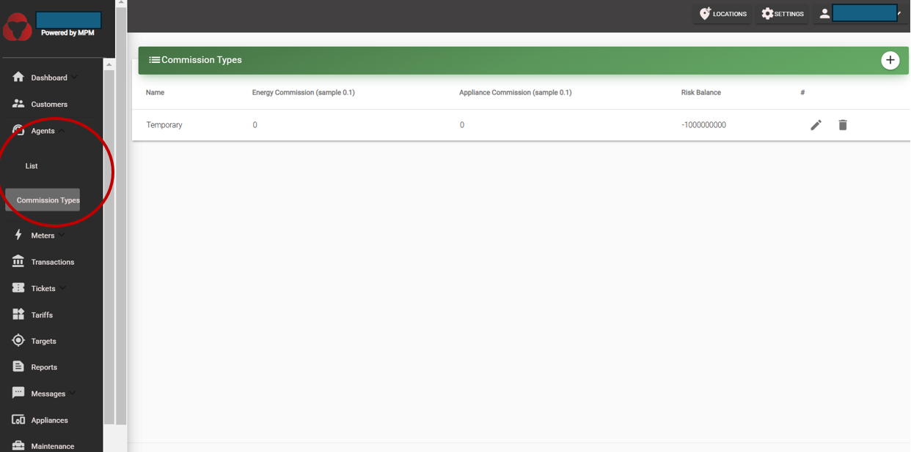

# Agents

Agents are company staff that are on site (or close to the site) and are able to support customers with tasks such as token generation (in exchange for cash payments), selling appliances, report customer issues to the company headquarters, etc.

Agents require the apps to do their work (see [Android apps](/usage-guide/android-apps)).

The user can register a new Agent on the MicroPowerManager account by going to the "Agents" menu and then pressing on ":heavy_plus_sign:".

The defined log in credentials by the user are then to be shared with the Agent, for them to be able to use the Agent account.
For more information on how to generate and manage tickets, see [Tickets](/usage-guide/tickets).

## Agent Commission Types

Agents receive cash from customers on site.
An agent's **outstanding balance** is the money it owes the company (i.e. it is the money it has collected on behalf of the company and has to transfer accordingly).

The **risk balance** is the maximum amount of money that an agent can collect before it has to transfer the money to the company.
When that balance is reached, agents will not be able to collect money anymore (generate tokens) or sell appliances (his account on the app will not work.
So, when the agent sends the balance money to the company, then headquarters has to manually adjust the outstanding balance by that agent through MicroPowerManager desktop.
This is done by creating a **receipt** on the specific agent’s profile.
When that receipt is created, balance of agent is removed/decreased to 0.

Agents are paid on a commission-basis.
There are 2 commission types:

- **Energy commission:** % of the energy transaction that is kept by the agent.
  Sample says 0.1 = 0.1%).
- **Appliance commission:** % of the appliance value that is kept by the agent.
  Sample says 0.1 = 0.1%).

## Assigning or changing the commission of an agent

1. Create a commission type under Agent --> Commission type (click on the ":heavy_plus_sign:" button at the top right corner).
2. You either create a new agent, or you go to the page of the specific agent for which you want to change the commission type.
3. If you create a new agent, you select the commission type you want form the drop box.
4. If you edit it from an existing agent, you go to the agent, press the "pencil" drawing  commission field, and select from the dropdown.

## Agent Transaction Entities

These records track money given to and returned by agents, keeping their balance up to date.

### Agent Charges

An **agent charge** represents money the company gives to the agent so that they can continue serving customers. Charges are created from the web panel (`Agents` → `Charge` → `+`). When a charge is saved, a matching balance entry is added so the credit appears in the agent’s ledger.

### Agent Receipts

An **agent receipt** records money collected back from the agent. You create receipts from the agent profile (`Agents` → `Receipts` → `+`). When a receipt is saved, the system will:

- capture the latest snapshot in the agent’s balance history,
- compute how much was already owed, what was collected since the last visit, and any prior difference,
- and update the agent’s totals — what they owe the company, the commission they’ve earned, and their current balance.

Receipts therefore do the opposite of charges: they settle the debt the agent owed to the company.

Each receipt automatically creates a detailed breakdown showing how the payment was calculated. It explains what the agent already owed before this visit, how much cash they just handed in, how much additional sales activity happened since the last time they checked in, any older outstanding amounts from before that, and the remaining balance after applying the payment (which never goes below zero).

You can view these details in the receipts tab of an agent profile to understand how the receipt amount was calculated.
