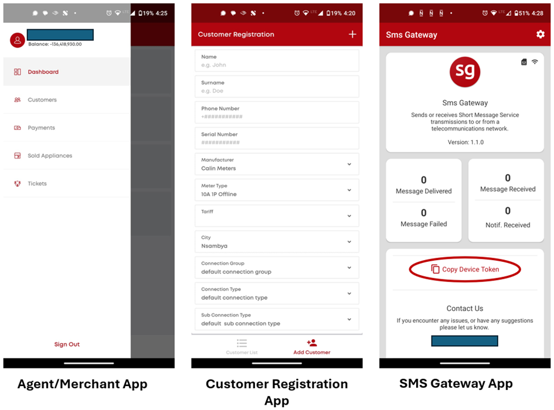
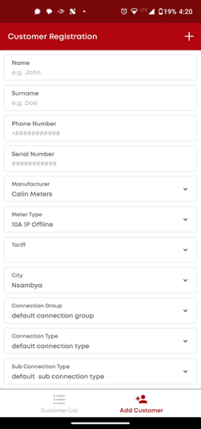
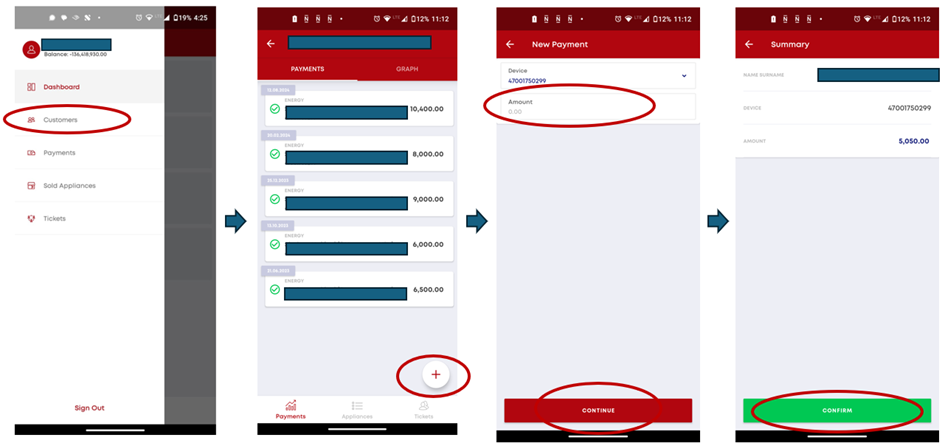
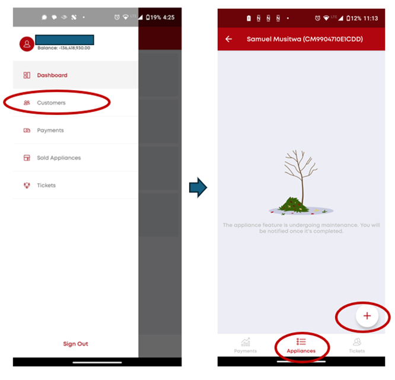
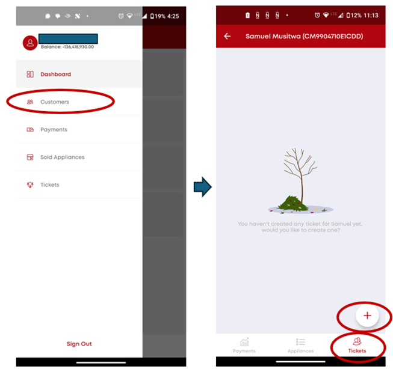

# Android Apps

As outlined in the [Get Started with MPM](../get-started), the MPM software package comes with 3 Android Apps, which are presented in more detail in this section:

The 3 apps (APK files) can be downloaded and installed as follows:

1. Accessing this link: <https://cloud.micropowermanager.io/#/welcome>

2. Click on the APK app files via your phone (Android required) – For Agent App Android version 6 or above is required)

3. Apps get installed

4. Once the app is installed on the phone, you will be asked for an URL.
   Following URL can be used: <https://api.cloud.micropowermanager.io>

5. Log in to the apps with the login credentials used to access MPM website interface (in case you have access to the website interface) or with the credentials given to you by management.

## Customer Registration App

New customer profiles can be created via this app or through the website directly.
The Customer Registration App enables the user/Agent to register new SHS and e-bike devices.
The Agent/user has to first install the app by following the steps outlined on the [Get Started with MPM](../get-started).
The app can be accessed using the log in credentials provided to the Agent/user by the company management.

Once logged in, the user should go to "Add Customer" on the bottom right of the screen and introduce the relevant customer data.

The device’s ID as per the manufacturer should be inserted on the field "Serial Number".
This will serve as the device identified to receive payments for that device.

> [!NOTE]
> "Meter Type", "Tariff", "Connection Group", "Connection Type" and "Sub Connection Type" fields are only relevant for mini-grid customers (not SHS and e-bike devices).

The app also enables the user to access the customer list for the systems for which it is in charge (see bottom left of the screenshot below).

## Agent/Merchant App

The purpose of the Agent app is to:

1. **Generate electricity tokens** for registered devices (in case the customer cannot use mobile money, it can rely on a local Agent to generate a token on his/her behalf after a cash payment).
   The Agent hands in the generated token by the app, which the customer can then use to top-up the applicable device (electricity meter, SHS or e-bike).
   To generate a token, follow these steps:

   a) Select the "Customers" Menu on the Agent/Merchant app

   b) Select the customer for which a token should be generated

   c) Click on the ":heavy_plus_sign:" at the bottom right of the skin

   d) Insert the currency amount the customer has paid (which should be converted into a token)

   e) Press "Continue" and then "Confirm".

   f) The app will give you the token, which you then share with the customer.

   

2. Sell an "Appliance" to a customer:

   a) Select the "Customers" Menu on the Agent/Merchant app

   b) Select the customer to which an appliance is to be sold

   c) Click on the "Appliance" logo at the bottom of the screen

   d) Click on ":heavy_plus_sign:" and define the appliance data (name, cost, etc.).

   

3. Issue a ticket for a customer:

   a) Select the "Customers" Menu on the Agent/Merchant app

   b) Select the customer to which a ticket is to be issued

   c) Click on the "Tickets" logo at the bottom right of the screen

   d) Click on ":heavy_plus_sign:" and insert customer issue to be resolved.

   
