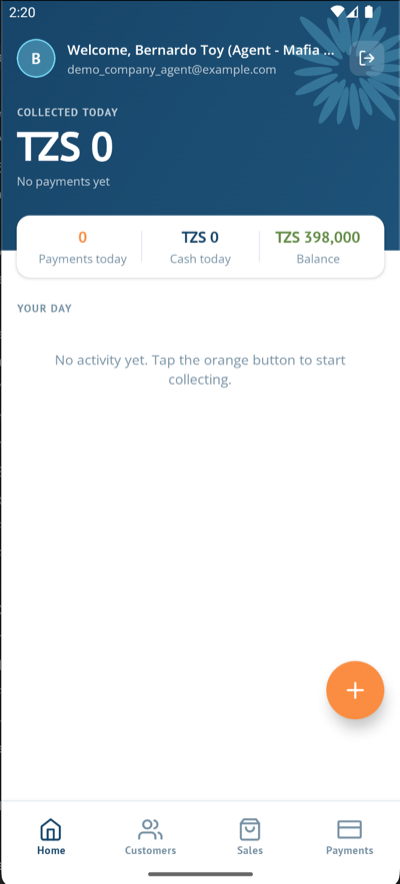
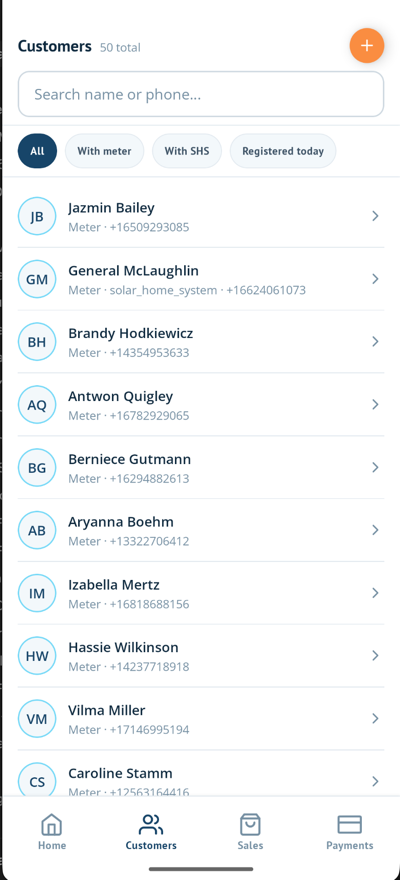
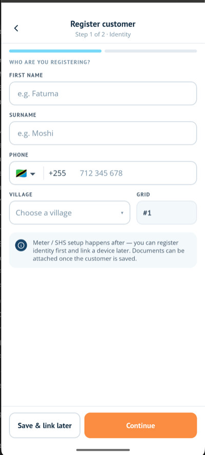
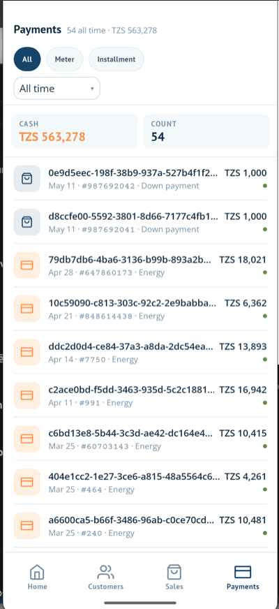
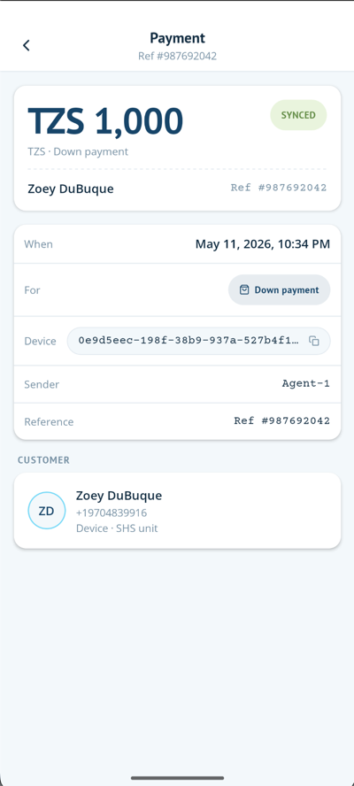
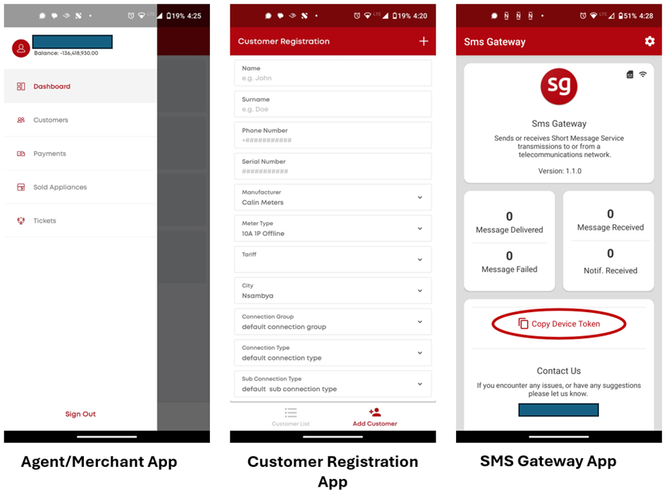

# The Field App

MicroPowerManager now ships a single, unified **Field App** that replaces the three separate Android apps it used to offer (Customer Registration, Agent/Merchant, and SMS Gateway).
It is an Android app that lets a field agent register customers, sell appliances, and collect payments — **online or offline**.

The app is the on-site companion to the MicroPowerManager website interface: agents act on behalf of the company in the field, and everything they record syncs back to headquarters.

## Installing and signing in

1. Download and install the app on your phone or tablet (Android 6 or above).

2. On first launch the app asks which backend to connect to:

   | Option   | Use when                                                                             |
   | -------- | ------------------------------------------------------------------------------------ |
   | `Demo`   | You want to explore against the public demo company                                  |
   | `Cloud`  | Your company is on the hosted MicroPowerManager Cloud (`cloud.micropowermanager.io`) |
   | `Custom` | Your company is self-hosted, local, or on a staging server                           |

3. Log in with the credentials used for the MicroPowerManager website interface, or with the credentials given to you by management.

## Home

The Home tab is the agent's daily dashboard.
It shows how much has been collected today, the number of payments and cash taken, and the agent's current **Balance** — the running figure of what the agent owes the company versus what they have settled (see [Agents](/usage-guide/agent-users) for how this balance and the risk limit work).
Below the summary, "Your Day" lists the agent's activity, and the orange ":heavy_plus_sign:" button starts a new collection.

## Customers

The Customers tab lists every customer the agent is responsible for.
You can search by name or phone and filter by those with a meter, with an SHS, or registered today.

To register a new customer, tap the ":heavy_plus_sign:" and follow the steps.
Registration starts with the customer's identity (name, phone, village, grid); the meter or SHS device can be linked afterwards, and documents can be attached once the customer is saved.

> [!NOTE]
> Registration works offline.
> If the agent has no connection, the customer is saved locally with a "PENDING SYNC" marker and uploaded automatically once the device is back online.
> Actions that need a server record (such as linking a meter or selling an appliance) stay disabled on a pending customer until the sync completes.

## Sales

The Sales tab is used to sell an appliance to a customer.
The agent picks the customer and appliance, then chooses how it is paid for:

- **Outright** — the full price is paid up front.
- **PAYG / credit** — the customer pays a down payment and clears the rest over time (for example a 12- or 24-month plan).

Once confirmed, the sale and its down payment are recorded against the customer and reflected in the agent's balance.

## Payments and token generation

The Payments tab records the cash an agent collects and, for electricity devices, generates the STS token on the spot — useful when a customer cannot pay with their own phone via mobile money.

To collect a payment and generate a token:

a) Open the **Payments** tab and tap the ":heavy_plus_sign:".

b) Find and select the customer (or the device) being paid for.

c) Enter the amount of cash the customer has handed over.

d) Press **Continue** and then **Confirm**.

e) The app records the payment and, for an electricity device, generates the token.
Read the token to the customer or tap to copy it so they can top up their meter, SHS, or e-bike.

Every payment can be reopened to view its receipt — the amount, what it was for, the device, the sender, and whether it has **synced** to headquarters yet.

## Migrating from the legacy apps

Earlier versions of MicroPowerManager were split across three separate Android apps.
The unified Field App now covers their day-to-day work in one place.

| Legacy app                    | Status in the Field App                                                         |
| ----------------------------- | ------------------------------------------------------------------------------- |
| **Customer Registration App** | Replaced by the **Customers** tab (now with offline registration).              |
| **Agent/Merchant App**        | Replaced by **Home**, **Sales**, and **Payments** (including token generation). |
| **SMS Gateway App**           | Not part of the Field App.                                                      |

> [!WARNING]
> **SMS Gateway App — deprecated.**
> Sending and receiving SMS is handled by the server-side SMS gateway integrations rather than a phone app.
> See [SMS](/usage-guide/sms), [Africa's Talking](/integrations-guide/africastalking), and [TextBee](/integrations-guide/textbee).

> [!NOTE]
> **Ticketing — to be added.**
> Issuing customer tickets from the field is not yet available in the Field App.
> In the meantime, tickets can be managed from the website interface (see [Tickets](/usage-guide/tickets)).
