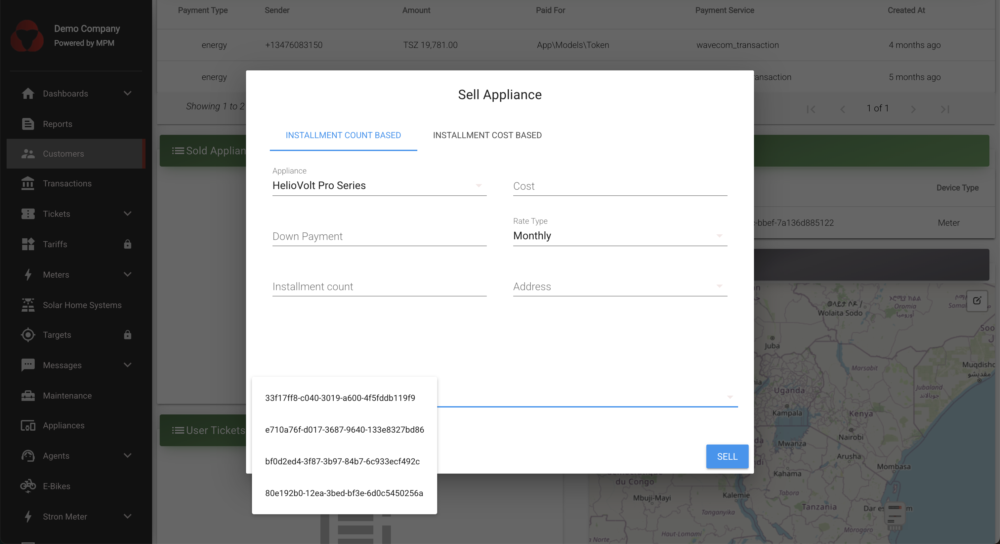

# Appliances

MicroPowerManager supports the management two kinds of appliance sales.

1. PayGO enabled device sales
2. Non-PayGO appliance sales

**PayGO enabled devices** such as Solar Home Systems (SHS) or E-Bikes are typically sold under rent-to-own schemes.
MicroPowerManager manages their PayGO functionality, including time and unlock token generation, through [Manufacturer Plugins](plugin-overview.md).
Customers make installment payments to keep the device active for a specified period.
Once the final installment is paid, the device becomes permanently unlocked and continues to operate without requiring further tokens.

**Non-PayGO appliances** are typically electronic products sold to customers on an rate based plan, such as water pumps, electric pressure cookers, mills, or televisions.
Unlike PayGO enabled devices, Non-PayGO appliances cannot be controlled using tokens.
They remain functional at all times.
Because of this, unpaid installments for Non-PayGO appliances are treated purely as outstanding debts rather than restricting device usage.

> [!INFO]
> The wording in MicroPowerManager and it's documentation is not 100% consistent.
> Find below a list aliases that might be used.
>
> **PayGO enabled device sales**: device-based, SHS device
>
> **Non-PayGO appliance sales**: non-device, appliance (note the duplication with appliance objects), debt-based

## Registering an Appliance for sales

Before selling an appliance to customers we need to register an appliance object in MicroPowerManager.
An appliance object vaguely represent an [SKU](https://en.wikipedia.org/wiki/Stock_keeping_unit), i.e. it describes the product your company can sell and specifies it's price point.

1. Go to `Appliances` and click on ":heavy_plus_sign:"

   

2. Choose `Solar Home System`, `E-Bike` for PayGo enable appliances or `Electronics` for non-PayGO appliance.

## Selling an Non-PayGO Appliance

In this subsection, the procedure to sell/assign a new appliance (non-device) to a customer is outlined:

1. If the customer is not registered, first use MicroPowerManager website interface to register a new customer (see [Customers](customers)).
   If the customer already exists, skip this point.

2. Go to the "Customer" menu, find the customer to which the created appliance is to be sold, go to "Sold Appliances", click ":heavy_plus_sign:" and assign the mentioned customer the recently created appliance.

   

   MicroPowerManager asks the user to select one of the 2 re-payment scheme options:

   a) **Installation count based**: user defines the down payment, the number of instalments under which the total appliance cost is to be financed, and the rate type (monthly or weekly).
   MicroPowerManager gives as output the instalment amount the customer has to pay.

   b) **Instalment cost based**: unlike the case above, in this case the user defines the instalment amount (as well as total appliance cost and payment rates (weekly or monthly).
   MicroPowerManager then calculates the number of instalments under which the total appliance cost is to be paid.

   

Kindly note that appliances can also be sold through the Agent App (see [Android Apps](/usage-guide/android-apps) for further information).

> [!NOTE]
> Future development work would include to update the Agent App so that not only appliances but also SHS and e-bike devices can be registered (right now Agent App does not enable to add a device with a serial number).

## PayGO enabled device sales

The process for selling a PayGO enabled device through MicroPowerManager is similar to selling a non-PayGO appliance.

However, before a PayGO enable device can be sold through MicroPowerManager the device has to exist in MicroPowerManager.

1. To to "Solar Home System" (or "E-Bike") section and confirm the device exists.
2. If it doesn't, follow the steps outlines in [Solar Home Systems](solar-home-systems.md) to create one.
3. Follow the appliance sales similar to Non-PayGO appliances.
4. In the "Sell Appliance" modal choose the corresponding device to be bound and assigned to the customer.

   

> [!INFO]
> It is important to select the correct device from the dropdown list.
> MicroPowerManager will only generate device and unlock tokens for the selected device.
