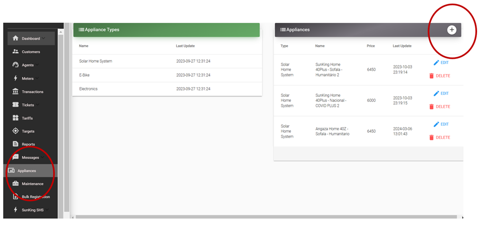
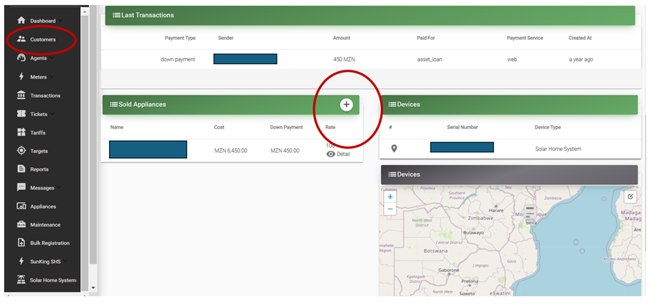
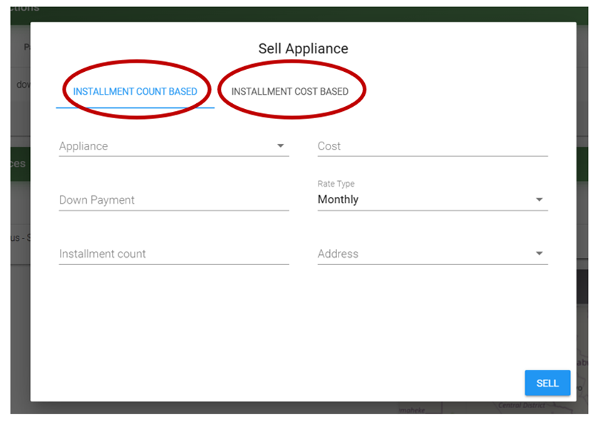

# Appliances

The system supports to sell SHS and e-bike devices as well as appliances to customers on a rate basis plan.
User can create whatever appliance it uses to sell (water pump, electric pressure cooker, mill, TV, etc.).
The steps to sell a SHS or e-bike to a customer as well as registering a new electricity device are explained here [Register a customer & device](/usage-guide/beforeusing#register-a-customer-device).

## Selling an Appliance

In this subsection, the procedure to sell/assign a new appliance (non-device) to a customer is outlined:

1. If the customer is not registered, first use MicroPowerManager website interface to register a new customer (see [Customers](customers)).
   If the customer already exists, skip this point.

2. Go to the "Appliance" menu of the website interface, click on ":heavy_plus_sign:" and define a new appliance (name and appliance cost/price).

3. Go to the "Customer" menu, find the customer to which the created appliance is to be sold, go to "Sold Appliances", click ":heavy_plus_sign:" and assign the mentioned customer the recently created appliance.
   MicroPowerManager asks the user to select one of the 2 re-payment scheme options:

   a) **Installation count based**: user defines the down payment, the number of instalments under which the total appliance cost is to be financed, and the rate type (monthly or weekly).
   MicroPowerManager gives as output the instalment amount the customer has to pay.

   b) **Instalment cost based**: unlike the case above, in this case the user defines the instalment amount (as well as total appliance cost and payment rates (weekly or monthly).
   MicroPowerManager then calculates the number of instalments under which the total appliance cost is to be paid.

Kindly note that appliances can also be sold through the Agent App (see [Android Apps](/usage-guide/android-apps) for further information).

> [!NOTE]
> Future development work would include to update the Agent App so that not only appliances but also SHS and e-bike devices can be registered (right now Agent App does not enable to add a device with a serial number).

