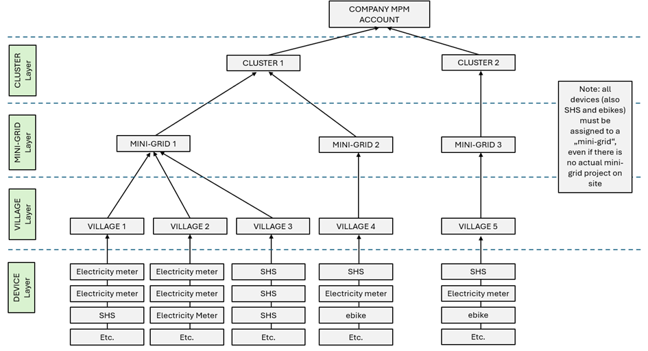
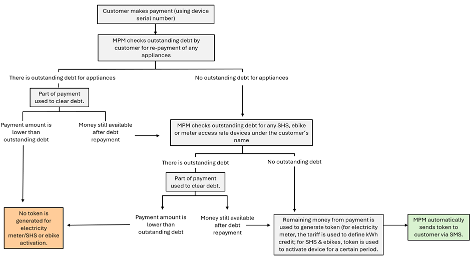

# Before using MPManager

The key component(s) of the system is a mixture of meter/customer. That
means both melts into each other a bit. The only way to register a
customer or a meter is to register them both at the same time. For that
reason from now on, every registered person will be mentioned as a
**customer**.

Clarification note: MPM users cannot create other devices (beyond existing electricity meters, SHSs and e-bikes). Each new device (whether a mini-grid pre-paid meter, SHS or e-bike) must be assigned under a pre-defined cluster, mini-grid project and village (i.e. even if a company is only managing 100 SHSs (and no mini-grid customers), a “mini-grid project” must be defined in MPM under which the 100 SHSs are registered. Potential development work would include substituting the term “mini-grid” for “catchment area”.

## Register a customer & device
**Registering new mini-grid customers (electricity meter devices):** To register new mini-grid customers, the Customer Registration App has to be used. After introducing the customer’s basic details (name, phone number, etc.), the app allows you to select the village where the customer lives, the meter manufacturer and the energy tariff that should be assigned to the meter. **Note that while new customers can be created via the website interface and existing meter devices can be re-assigned to customers, new meter devices can only be registered via the mentioned Customer Registration App.**
**Registering SHSs and e-bike devices:** Registration of these devices can be done both via the Customer Registration App as well as the website interface. 
If user wants to use the app, there are two relevant inputs (on top of the usual customer data): 1) a dropdown menu listing all manufacturers integrated with MPM (including both SHS and electricity meter manufacturers) and 2) an input field to insert the device serial number (kindly note that the app requests for “meter serial number” but in fact also refers to “SHS serial number” or “e-bike serial number”, as applicable). Future development work would entail adapting this field name to a more generic “device serial number”.
If user wants to register a new SHS or e-bike device via the website interface, applicable menu section should be clicked (left side bar, click on "Solar Home System" or "e-bike"). Then click on the "+" button at the top right corner of the applicable screen and introduce requested data (device serial number, manufacturer, appliance (device) type.) Kindly check the "Solar Home Systems" and "E-bike" sections of the documentation to see a screenshot of the applicable menus.

## Tariffs
It is basically the energy price per kWh with an optional access rate/subscription fee. The operator is free to define the period of that fee. Ex: Every 7 days. Such a subscription fee may also not be introduced at all. This feature only applies for mini-grid meter device type, NOT for SHS and e-bikes. For SHS and e-bikes, the payment scheme is set up at the time of registering the device on MPM.
To define payment schemes for SHS and e-bikes go to “Appliance” menu (see “Appliance” section below).
## Payment Channels
The list of payment channels through which MPM can receive mobile money is outlined on the section “Getting Started with MPM above”.
## Payments
Each incoming payment has to contain the device serial number. That is the unique number that is used to identify the other devices where the money could be spend. After payment has been received, the system automatically checks no outstanding debt from the customer remains to be paid, before generating the applicable token. 

MPM is designed in a way that the transferred money by the customer will first be used to clear outstanding debt by that customer (from an appliance loan and tariff access (if applicable)) before being converted into a token. Therefore, only the remaining money after debt clearing will be converted into a token for the device number for which the transaction has been done.Note: a device number is required even if the customer intends not to generate a token for any of the devices (electricity meter, SHS or e-bike) but simply repay an appliance. In which case the customer should transfer the money amount matching the outstanding appliance debt (to avoid MPM generating a token for that device with the surplus amount).
Note: If the entered device serial number is not valid, the system refuses the payment automatically.
