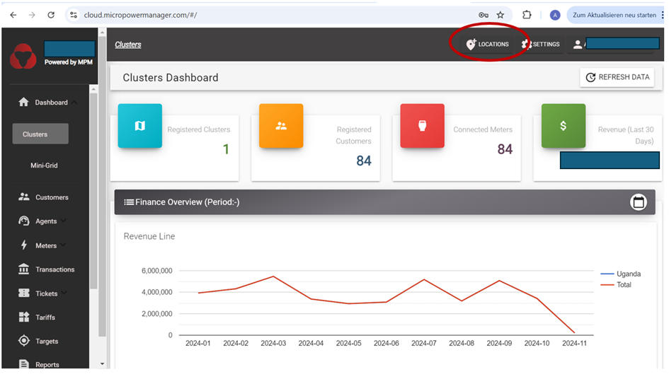

# Cluster Dashboard

The cluster dashboard provides an overview of the portfolio of systems (whether mini-grids or solar home systems (SHS)) that the user has.
A "cluster" is understood to bundle several mini-grids, which in turn (potentially) bundle several villages (although a single village can be assigned to a mini-grid).
Each village bundles in turn several devices (whether electricity meters, solar home systems or e-bikes.
Where customers are mini-grid customers, they are registered via the energy meter number.
Where customers are solar home system or e-bike users, the SHS or e-bike serial number is used for registration purposes.

The cluster dashboard is composed of the following sections:

1. Small informative boxes at the top of the screen summarize total # of clusters, # of registered customers (applicable for SHS), # of connected meters (applicable for mini-grids) and total revenue.

2. A financial overview of the revenue collected for the selected period.

3. A map visualizing where the clusters/mini-grids/SHSs/e-bikes are installed.

In order to add a new mini-grid, cluster or village to the MicroPowerManager account, following steps must be undertaken (as depicted on the photos below):

1. Click on "Locations" at the top right of the screen

2. Select applicable option.

3. Fill the required fields.

   
   
