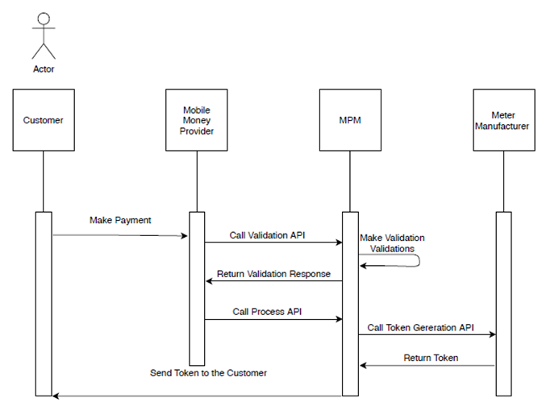

# Onboarding and Company registration

## Setting up your MPM company account

1. During the sign-up process, you will be required to select the plug-ins relevant to your company (for further information on plug-ins, see further below on this page).
2. Create users under that company account (a user should be created for every person that should be able to access the company’s MPM account via the website interface as well as persons that should work with the Android apps outlined above).
3. Create a password for password protected areas, so that only the team members with knowledge of the password can access sensitive information (Password protected areas are: Tariff-setting, Targets-setting, Overall company Settings, Addition of locations (village, mini-grid, cluster)\*.
4. Create the locations (under “Settings”) where your systems/devices are to be located (every device must be assigned to a cluster, mini-grid and village).
5. Register your customers (with applicable device numbers) and assign them appliances (where applicable), as follows:
   a) To register new mini-grid customers, the Customer Registration App is required. Basic customer data together with the electricity meter serial number are required (kindly see the “Register a customer & device” section for further information.
   b) To register new Solar-Home System (SHS) customers, e-bike customers or assign/sell new appliances to existing customers, kindly check the “Register a customer & device” section of this User Manual.

\*Password-setting to protect some sections of your account can only be generated at account setting stage. To change this password ex-post, you will have to contact EnAccess (Enaccess can change the password directly on the database).

## MPM Software Plug-ins

The below diagram depicts the integration layers of MPM with mobile money providers and device manufacturers (whether electricity meter, SHS or e-bike).

In order to use MPM software to manage your customer portfolio, you will have to activate the relevant (manufacturer) plug-ins as well as the relevant telecommunication provider plug-ins.
For example, if you have Calin pre-paid meters or SunKing Solar Home Systems in your portfolio, you should activate the “Calin” and “SunKing” plug-ins to be able to manage your customers with MPM software. Additionally, if your customers rely on Airtel or Vodacom, you should activate the applicable Airtel or Vodacom plug-ins to enable MPM to generate tokens when receiving mobile money payments.

Currently the following manufacturer plug-ins are available:

- Spark Meter
- Steama Meter
- Calin Meter
- Calin Smart Meter
- Kelin Meter
- Stron Meter
- Microstar Meter
- Gomelong Meter
- SunKing Solar Home System (SHS)
- Angaza Solar Home System (SHS)
- DalyBms (e-bike)

Currently the following telecommunication provider plug-ins are available:

- Swifta Payment
- Mesomb Payment
- Viber Messaging
- Wave Money Payment
- Wavecom Payment
- Airtel Tanzania (plug-in activation requires additional support by EnAccess)
- Vodacom Tanzania (plug-in activation requires additional support by EnAccess)
- Airtel Uganda (plug-in activation requires additional support by EnAccess)
- Vodacom Mozambique (integration currently on-going)

Note that the activated plug-ins can be changed/removed/added later on from the website interface (under “Settings”).

**Payment flow:**

