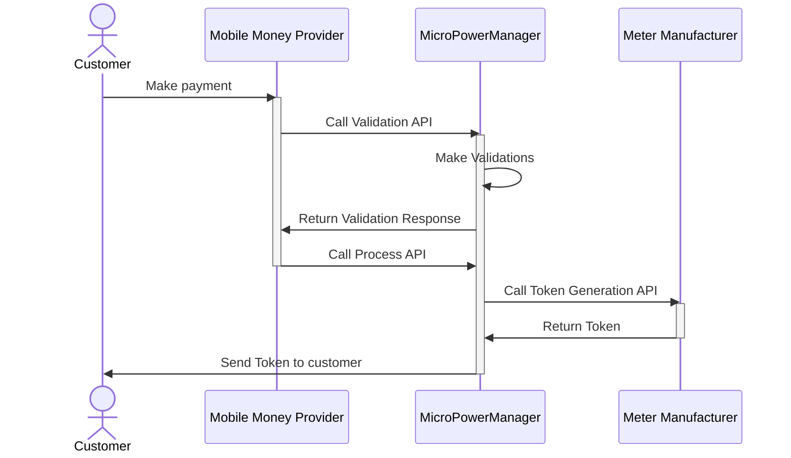
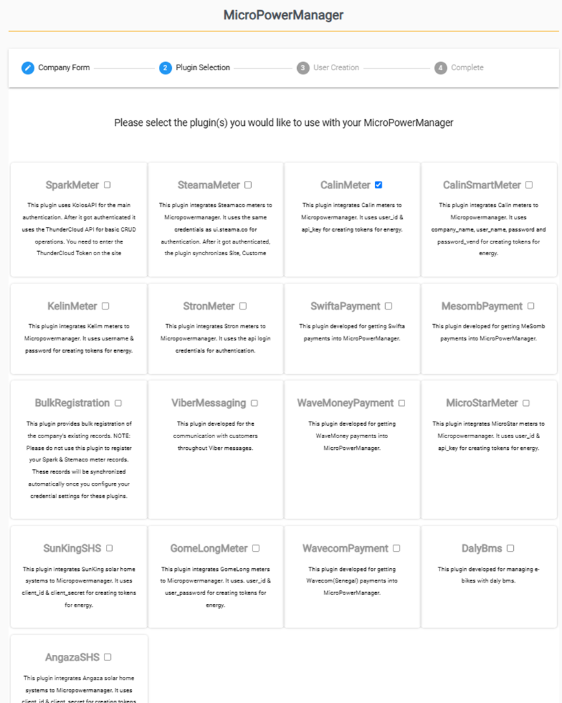
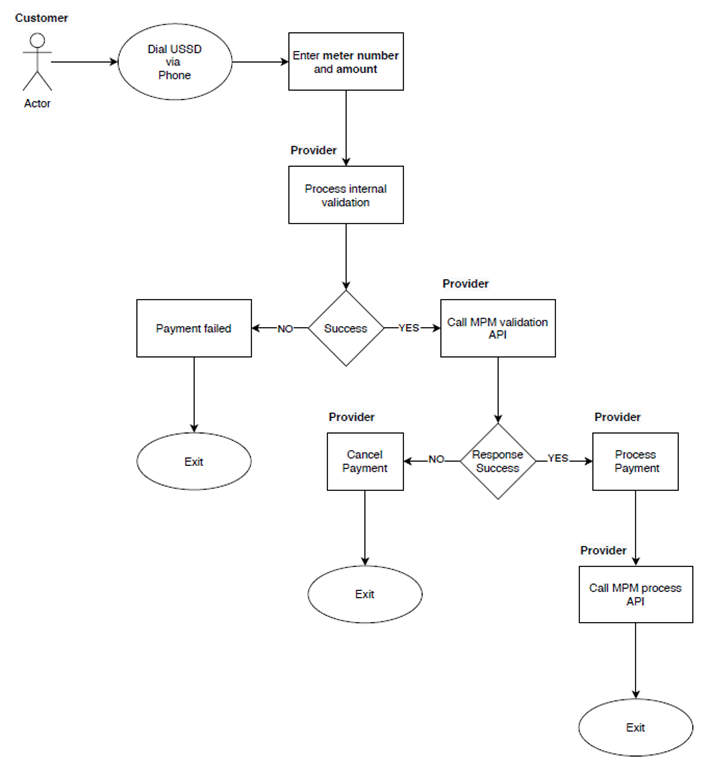

# Onboarding and Company registration

## Setting up your MicroPowerManager company account

1. During the sign-up process, you will be required to select the plug-ins relevant to your company (for further information on plug-ins, see further below on this page).
2. Create users under that company account.
3. Create a password for [Password Protected Pages](/usage-guide/user-management-access-control#protected-pages-password), so that only the team members with knowledge of the password can access sensitive information.
4. Create the locations (under "Settings") where your systems/devices are to be located (every device must be assigned to a cluster, mini-grid and village).
5. Register your customers (with applicable device numbers) and assign them appliances (where applicable), as follows:
   1. To register new mini-grid customers, the Customer Registration App is required.
      Basic customer data together with the electricity meter serial number are required (see [Before Using MPM](beforeusing) for further information).
   2. To register new Solar-Home System (SHS) customers, e-bike customers or assign/sell new appliances to existing customers, kindly check [Before Using MPM](beforeusing).

## MPM Software Plug-ins

The below diagram depicts the integration layers of MicroPowerManager with mobile money providers and device manufacturers (whether electricity meter, SHS or e-bike).

In order to use MPM software to manage your customer portfolio, you will have to activate the relevant (manufacturer) plug-ins as well as the relevant telecommunication provider plug-ins.
For example, if you have Calin pre-paid meters or SunKing Solar Home Systems in your portfolio, you should activate the "Calin" and "SunKing" plug-ins to be able to manage your customers with MPM software.
Additionally, if your customers rely on Airtel or Vodacom, you should activate the applicable Airtel or Vodacom plug-ins to enable MPM to generate tokens when receiving mobile money payments.

See [Plugin Overview](/usage-guide/plugin-overview) to have an overview of active and available plug-ins.

Note that the activated plug-ins can be changed/removed/added later on from the website interface (under "Settings").

**Payment flow:**

