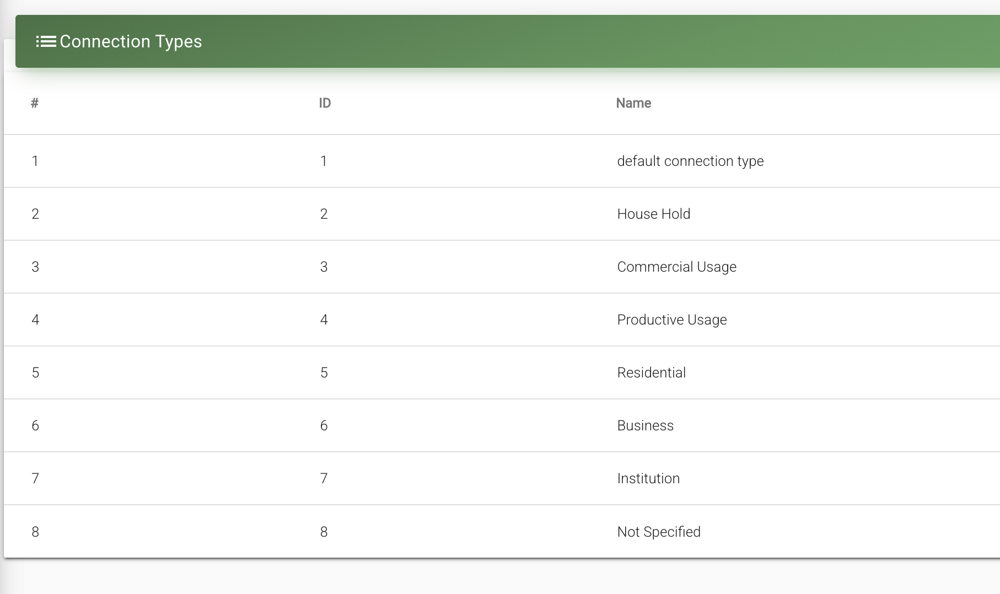
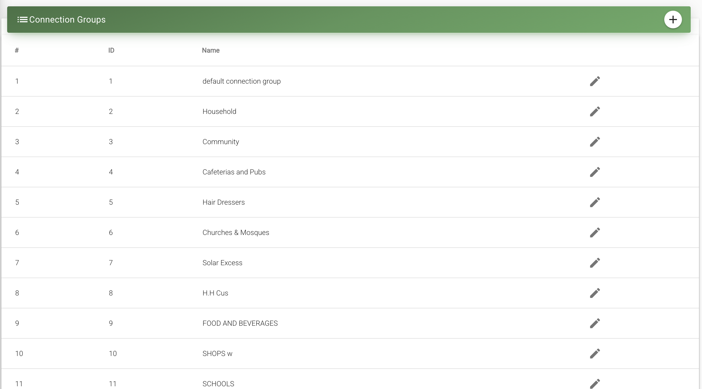

It is common in the rural electrification sector to have different tariff levels for different types of customers (especially in the case of mini-grid projects).
MPM enables to define different customer types and groups and to assign different tariff levels to each.

# Connection Types

"Connection Types" refers to the broad categorization of each electricity connection by the primary function the electricity supply serves.
Common connection types are Residential, Commercial (small-scale businesses), Productive (large-scale businesses) and Community (such as church, mosques, etc.).

MPM users can define various connection types and assign a different tariff level to each (see "Tariff" section).

# Connection Groups

Connection groups are an additional layer of flexibility given to MPM users in order to further sub-categorize each connection type.
No different tariff levels are assigned to the groups of a connection type, but the distinction makes customer management tasks simpler.
For instance, within the "Commercial Type" one could define the Connection Groups "hairdressers", "groceries", "restaurants", "entertainment", etc..
Under the "Community Type" one could define the Connection Groups "religious community service", "school/health", etc..

