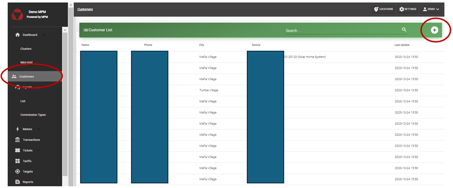
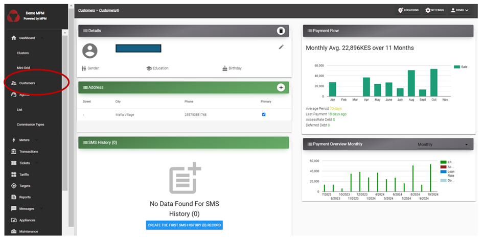

# Customers

MicroPowerManager customers are listed under `Customers` in the sidebar.
This table contains the customers' name, phone number, city, and device number.
The search function also includes all those fields.
By clicking on a customer, the customer’s profile page will be loaded
Data parameters included are:

• Basic information: Name, Surname, Birth date, etc.

• Payment flow: It is a chart that shows how often the customer makes payments.

• Addresses: A list of the addresses that belong to the customer.

• Sold Assets: The SHSs, e-bikes and appliances sold to that customer, including a detailed list of the payments.

• Payment Overview: Shows how the sent money is spent (Energy, Access Rate payment, SHS, etc.).

• List of tickets that belong to the customer.

• A list of the devices which belong to the customer and a map where the meters are visually displayed.

Some of the elements are editable (i.e.: name, surname) or addable (i.e.: ticket, address).
New Customers can be added through both the customer registration app (together with a device) or the website interface by clicking on the ":heavy_plus_sign:" on the "Customer" Menu.

