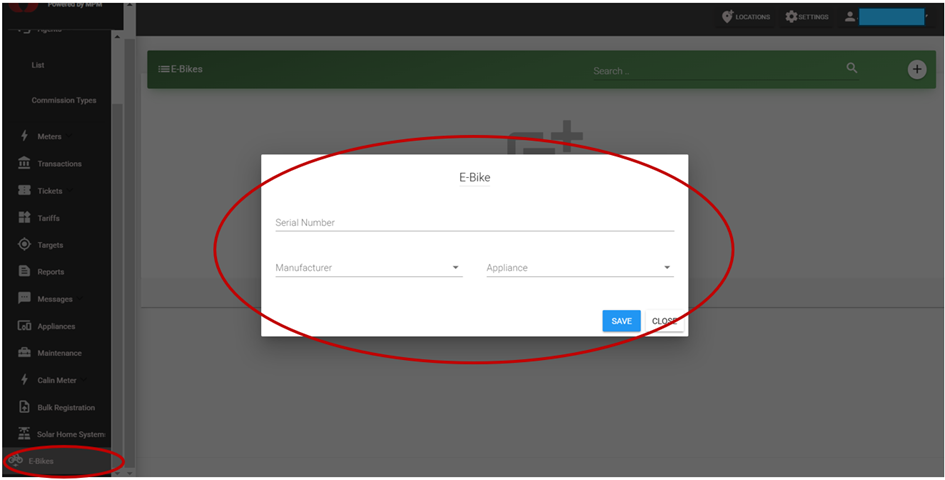

# E-bikes

This is the section listing all e-bike devices registered under your company account. It is the analogous section to the “Meter” and “Solar Home Systems” menus for mini-grid connections and SHS devices, respectively.

E-bike devices can be registered via the Customer Registration App (see "Android Apps" section) or directly through the website interface (Select "E-bike" menu on the left sidebar --> Click "+" --> introduce device data as requested.)

