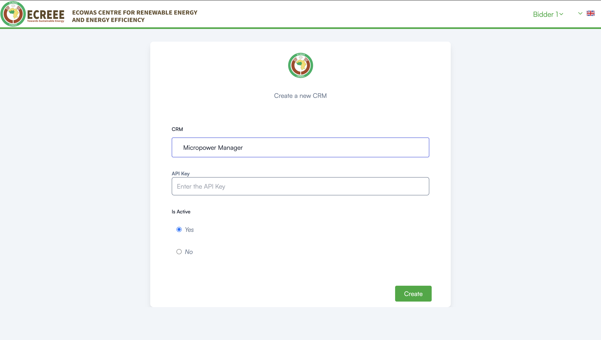

# ECREEE e-Tender Integration Setup Guide

This guide provides step-by-step instructions to set up the integration between **MicroPowerManager (MPM)** and the **ECREEE e-Tender platform** for milestone-based progress tracking and disbursement verification.

---

## Overview

The **ECREEE e-Tender platform** enables transparent management and monitoring of energy project tenders, including milestone validation and payment disbursements.

This integration allows ECREEE e-Tender to securely retrieve **transaction and operational data** from **MicroPowerManager**, supporting:

- Milestone verification
- Performance-based disbursement
- Financial transparency
- Automated reporting

---

## Prerequisites

Before starting, ensure the following:

- Active **ECREEE e-Tender bidder account**
- Access to a **MicroPowerManager instance** with transaction data
- **Admin access** to MicroPowerManager to enable the integration plugin
- Ability to generate API keys in MicroPowerManager

---

## Step 1: Access ECREEE e-Tender Platform

1. Navigate to the ECREEE e-Tender login page
2. Enter your registered email and password
3. Click **Sign In** to access your dashboard

---

## Step 2: Enable ECREEE e-Tender Plugin in MicroPowerManager

Before ECREEE e-Tender can access your data, the integration plugin must be enabled in MicroPowerManager.

1. Log in to your **MicroPowerManager** instance
2. Navigate to **Settings** → **Configuration** → **Plugins**
3. Locate the **ECREEE E-Tender** plugin
4. Toggle the plugin **ON**

---

## Step 3: Generate API Key in MicroPowerManager

To allow secure data access:

1. In MicroPowerManager, go to **Settings** → **API Keys**
2. Click **Generate New API Key**
3. Copy and securely store the generated API key

> This API key grants access to transaction and operational data.  
> Do not share it publicly.

---

## Step 4: Register MicroPowerManager in ECREEE e-Tender (CRM Setup)

1. In the ECREEE e-Tender dashboard, navigate to **CRM Management**
2. Click **Create New CRM**
3. Fill in the following fields:
   - **CRM**: Select **`Micropower Manager`**
   - **API Key**: Paste the API key generated in Step 3
   - **Is Active**: Select **Yes**
4. Click **Create** to save the configuration

---

## Step 5: Verify Integration

Once the CRM is created and active:

1. ECREEE e-Tender will automatically begin retrieving data from MicroPowerManager
2. Navigate to relevant tender or milestone views
3. Confirm that transaction and progress data is visible

Data synchronization occurs automatically based on ECREEE e-Tender schedules.

---

## How the Integration Works

1. ECREEE e-Tender securely authenticates using the provided API key
2. Embedded integration services query MicroPowerManager for:
   - Payment transactions
   - Customer and site references
   - Meter and device identifiers
   - Timestamps and amounts
3. Retrieved data is used to:
   - Validate milestone completion
   - Support disbursement approvals
   - Enhance reporting and auditability

> ⚙️ API queries are optimized for performance and reliability.

---

## Troubleshooting

### No Data Visible

- Confirm the plugin is enabled in MicroPowerManager
- Ensure the API key is correct and active
- Verify that transaction data exists in MPM

### Authentication Errors

- Regenerate the API key in MicroPowerManager
- Update the key in ECREEE e-Tender CRM configuration

### Incomplete Data

- Check that transactions fall within the expected reporting period
- Confirm site or project mappings in MicroPowerManager

---

## Support

For assistance:

- **ECREEE e-Tender issues**: Contact the ECREEE platform administrator
- **MicroPowerManager issues**: Review system logs or contact the MPM support team

---

This integration enables **secure, automated, and transparent data exchange** between MicroPowerManager and ECREEE e-Tender, supporting performance-based project financing and milestone-driven disbursements.
