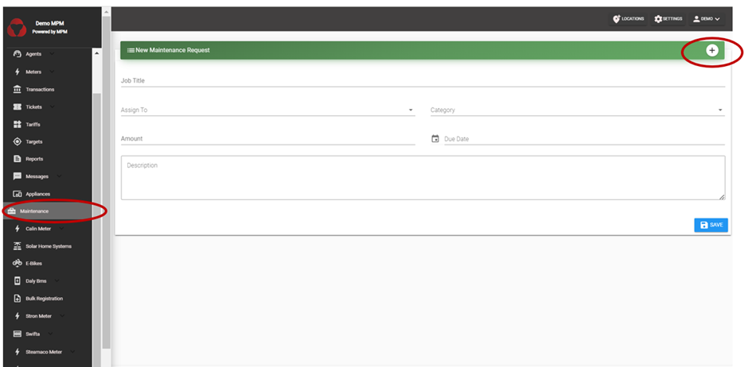
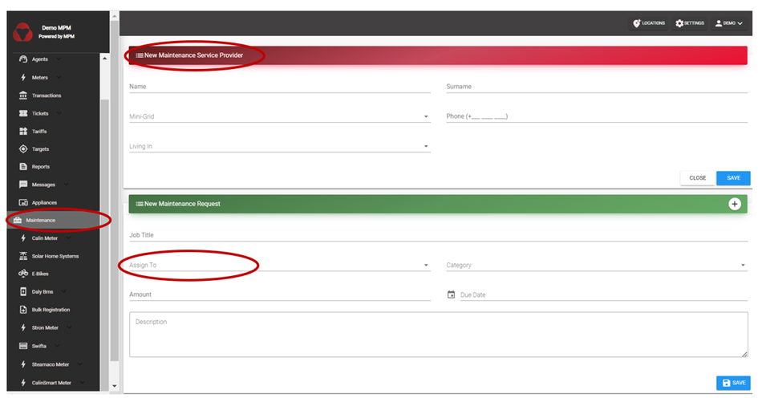

# Maintenance

As outlined on the “Terminology” section, “Maintenance Service Providers” are usually persons that are not hired on a fixed-term by the company but are available on-demand near the site to respond to technical faults.

Such technical issues are related to a system as a whole (for instance, a mini-grid), rather than being customer-specific. To **generate maintenance requests**, go to the “Maintenance “ menu on the website interface (see below). If the maintenance service provider to which the user wants to assign the maintenance request is already registered on the MPM account, simply create the request (state the task to be done, the deadline and the price to be paid to the maintenance service provider) and assign it to the corresponding maintenance service provider. If the maintenance service provider is still to be registered, click first on “+” to register a new maintenance provider. Then you can proceed to create a new “Maintenance request”. Once the user clicks on “Save”, an SMS notifying the maintenance service provider of the task to be resolved is automatically sent. The maintenance service provider can respond to this SMS (by confirming receipt, or communicating that issue has been resolved, for instance). Note that MPM was originally developed to enable the recording of responses from maintenance service providers on the MPM account (provided the user relies on the SMS Gateway App – see “Android App” section). However, it would currently require additional code adaption of the SMS Gateway App to re-activate this feature.

The created maintenance request will also appear on the “Ticket” menu. Note: MPM currently does not allow to delete maintenance service providers (even if they stop working/being available for the company).

