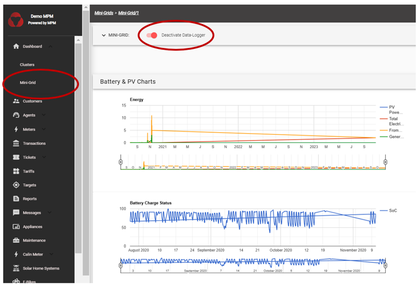

# Mini-Grid Dashboard

Mini-grids are the building blocks of clusters.
This dashboard provides information about the selected Mini-Grid, such as **revenue per customer type**, **targeted revenue per customer type**, **Revenue Trends**, **Sold energy (kWh)**, **Processed transactions**, **Tickets overview (for that mini-grid)**.
This first section is therefore only relevant for mini-grid operators (not solar home system or e-bike distributors).
However, even SHS operators/distributors will have to define a mini-grid at the time of registering their SHS portfolio.

MicroPowerManager software enables to transfer system technical data to the website interface, provided a data logger is installed on site.
For mini-grid systems, parameters such as PV power production, energy stored, total electricity supply, battery charge status and diesel generator output (if a diesel generator is installed on site) can be visualized.
For these features to be enabled, the user will require support from EnAccess to receive the data logger to be installed on site.

