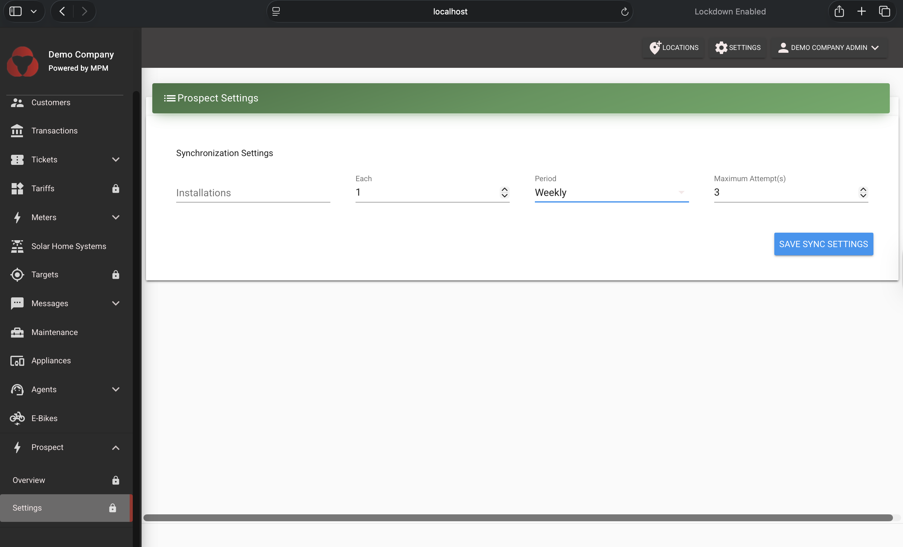

# Prospect Integration Setup Guide

This guide provides step-by-step instructions for setting up and integrating Prospect with your MicroPowerManager project for data analytics and monitoring.

## Overview

Prospect is a data analytics platform that allows you to import, analyze, and visualize data from your energy systems. This integration enables you to push installation data, customer information, and other relevant metrics to Prospect for comprehensive reporting and analysis.

## Prerequisites

- Access to Prospect demo platform
- Valid login credentials for Prospect
- MicroPowerManager instance with installation data to export
- Appropriate permissions to configure plugins in MicroPowerManager

## Getting Started

### Step 1: Access Prospect Platform

1. Navigate to the Prospect demo platform: [https://demo.prospect.energy/](https://demo.prospect.energy/)
2. Login using your provided email and password credentials

### Step 2: Navigate to Data Import

1. After successful login, you'll land on the main dashboard
2. Navigate to the **Data** section in the main menu
3. Select **Import** from the dropdown options

## Project Setup

### Step 3: Create a New Project

1. You'll see a page listing all existing projects with an option to create a new one
1. Click the **"NEW PROJECT"** button to start creating a project

1. Provide the following information:
   - **Project Name**: Enter a descriptive name for your project
   - **Description**: Add relevant details about the project scope

1. Click **Create** to proceed

### Step 4: Configure Data Source

After project creation, you'll be redirected to the project page where you can configure your data sources.

1. Click on the **"Create Datasource"** link to begin configuration

## Data Source Configuration

### Step 5: Select API Push Data Source

1. Choose **API Push** from the available data source options
2. You'll find this under the **"Other"** category in the datasources list
3. Provide a descriptive name like `Test API Push Import`
4. Click **Next** to continue

### Step 6: Choose Connection Type

Select the appropriate connection type based on the data you want to sync:

- **Installations** - For device installation data
- **Agents** - For agent/merchant information
- **Customers** - For customer profiles

For this guide, we'll select **Installations**.

### Step 7: API Configuration Details

After selecting your connection type, you'll see the API configuration page with:

- **API Endpoint**: The URL where you'll POST your data
- **Documentation Link**: Access to full API documentation
- **Authorization Details**: Bearer token for authentication

This page displays the key information you'll need to configure the integration, including the POST URL endpoint for sending data, the authorization bearer token required for API authentication, and a link to the complete API documentation.

### Step 8: Activate Data Source

1. Click **Next** to proceed to activation
1. Check the activation checkbox to enable the data source
1. Review the data source configuration:
   - **State**: Active/Inactive status
   - **Data Category**: installations
   - **Organization**: Your organization details
   - **Secret**: API authentication token

## Configuring the MPM Integration

Now that you have obtained the authorization token and API endpoint from Prospect, you need to configure the Prospect plugin in MicroPowerManager.

### Step 9: Enable Prospect Plugin

1. Log in to your MicroPowerManager instance
2. Navigate to **Settings** → **Configuration** → **Plugins**
3. Locate the **Prospect** plugin
4. Enable the plugin by toggling the switch to the "On" position

### Step 10: Configure Plugin Settings

After enabling the plugin, you need to configure it with the credentials obtained from Prospect:

1. Navigate to the **Overview** page (this is typically in the Prospect plugin section)
2. Enter the **Authorization Token** that you obtained from Step 8 of the Prospect platform
3. Specify the **BASE_URL** - this should be the API endpoint URL shown in Step 7 (e.g., `https://demo.prospect.energy/api/v1/in/`)
4. **Note**: Currently, we are working with installations data. More data types will be added in future updates
5. Click **Save** to store your configuration

### Step 11: Configure Synchronization Schedule

Set how often you want MPM to sync data to Prospect:

1. Navigate to the **Settings** page within the Prospect plugin
2. Configure the synchronization frequency:
   - **Hourly** - Syncs data every hour
   - **Daily** - Syncs data once per day
   - **Weekly** - Syncs data once per week
   - **Yearly** - Syncs data once per year
3. Choose the appropriate schedule based on your needs
4. Save your configuration

## How It Works

Once configured, the Prospect plugin will:

1. Automatically extract installation data from your MPM database
2. Create CSV files containing the installation data
3. Push the data to Prospect using the configured API endpoint and authentication token
4. Run according to your specified schedule (hourly, daily, weekly, or yearly)

The integration handles all data synchronization automatically, so you don't need to manually export or import data.

## Project Management

### Viewing Projects and Data Sources

1. Return to the projects list to see all configured projects
2. Click on any project to view its associated data sources
3. Monitor data source status and manage configurations as needed

## Troubleshooting

### Common Issues

1. **Plugin Not Syncing Data**
   - Verify that the Prospect plugin is enabled in MPM settings
   - Check that the API token and BASE_URL are correctly configured
   - Ensure the token hasn't expired
   - Verify network connectivity between MPM and Prospect

2. **Data Not Appearing in Prospect**
   - Check MPM logs for any sync errors
   - Verify that there is installation data available in your MPM database
   - Confirm that the schedule is correctly configured and the sync has run
   - Check Prospect platform for any incoming data errors

3. **Configuration Issues**
   - Ensure the BASE_URL matches the API endpoint from your Prospect datasource
   - Verify the authorization token is correct and up-to-date
   - Check that you have appropriate permissions to configure plugins

### Checking Sync Status

You can monitor the sync status by:

1. Checking MPM logs for Prospect-related entries
2. Verifying data appears in your Prospect project dashboard

### API Documentation

For complete API reference and additional endpoints, visit:
`https://demo.prospect.energy/api-docs/index.html`

## Next Steps

1. **Monitor Sync Status**: Check that data is being successfully synced to Prospect according to your configured schedule
2. **Verify Data**: Use the Prospect platform to verify that your installation data appears correctly
3. **Additional Data Types**: As more data types become available (agents, customers, etc.), you can configure those in the MPM plugin settings
4. **Analytics Setup**: Configure dashboards and reports in the Prospect platform to analyze your data

## Support

For technical support or questions regarding Prospect integration:

- Review the API documentation
- Check the Prospect platform help resources
- Contact the Prospect team for access-related issues

---

This integration enables comprehensive tracking and analysis of your energy system installations, providing valuable insights for business operations and customer management.
