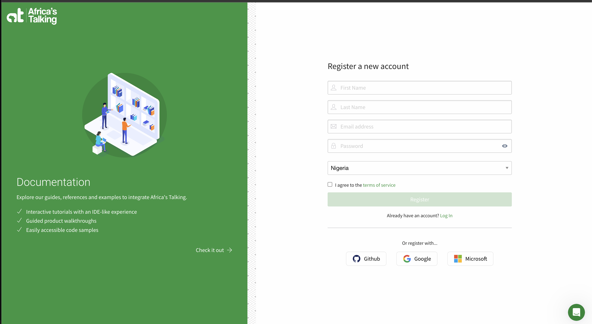
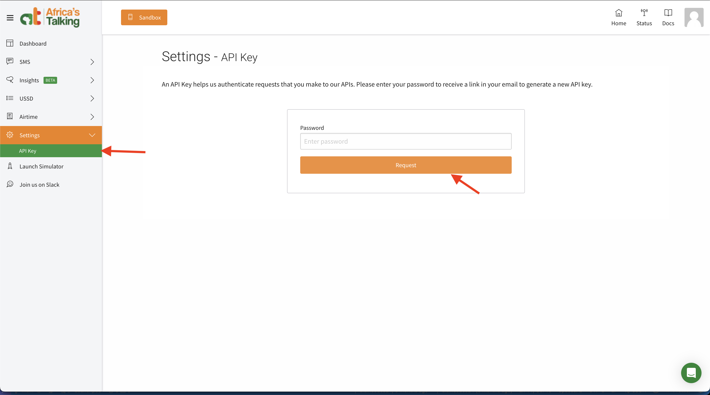
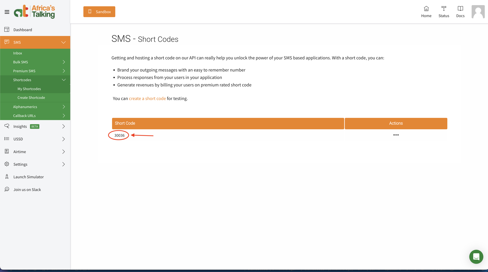
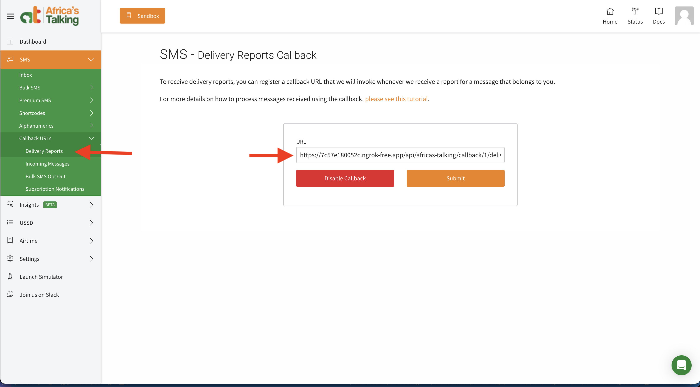
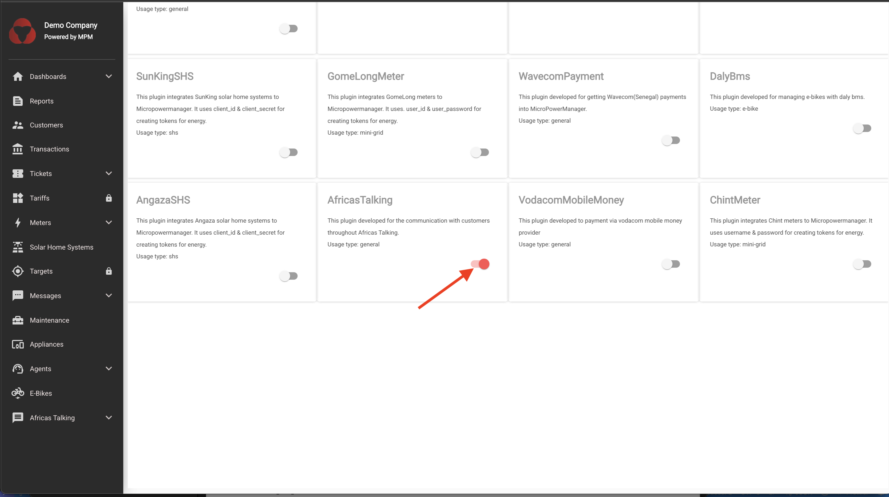
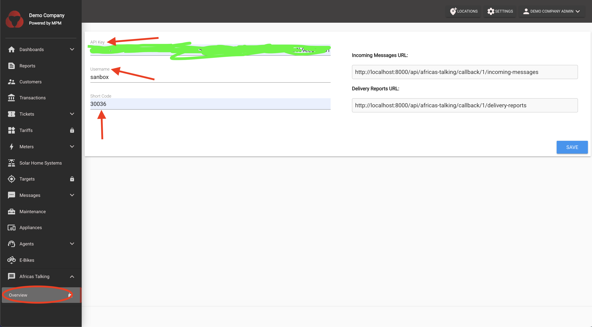
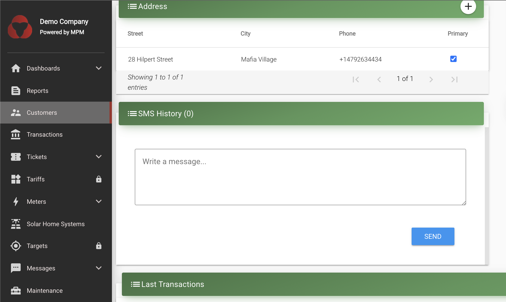

# SMS/Messages

SMS is the key communication infrastructure.
It is used during `Transactions` and `Maintenance` requests.
Headquarter staff can therefore send SMS to customers, agents and service providers via the website interface.
Furthermore, it can also be used by the company to reach out to its entire (or part of its) customer base, in instances such as wanting to inform on a specific event (such a planned/unplanned electricity cut in case of mini-grid operation, or a marketing campaign).
That is the reason why `SMS` is listed in the sidebar as an extra service.

The manager/admin can send SMS's to the customers of a specific Mini-Grid, to a specific customer group/type or single customers.

## Setup SMS Delivery using AfricasTalking on MPM

This guide will walk you through the complete setup process for integrating
AfricasTalking SMS service with MicroPowerManager (MPM) to enable SMS
notifications and communications.

### Prerequisites

- Access to MPM admin panel
- AfricasTalking account (free sandbox account is sufficient for testing)
- Basic understanding of API integrations

### Step 1: Create AfricasTalking Account

1. Visit [AfricasTalking](https://account.africastalking.com/auth/register)
2. Fill in your details and verify your email address
3. Complete the account setup process



### Step 2: Generate API Key for Plugin

1. Log into your AfricasTalking dashboard
2. Navigate to **Settings** → **API Key**
3. Click **Request**
4. Copy the generated API key - you'll need this for MPM configuration



### Step 3: Set Up SMS Short Code

1. In your AfricasTalking dashboard, go to **SMS** → **Short Codes**
2. Request a short code for your application
3. Note down the assigned short code number
4. Configure the short code settings as needed for your use case



### Step 4: Register SMS Delivery Callback URL

1. In your AfricasTalking dashboard, go to **SMS** → **Callback URLs**
2. Set up the delivery callback URL to point to your MPM instance: Copy the url
   from the plugin overview page

   ```bash
   https://your-mpm-domain.com/api/africas-talking/callback/1/delivery-reports
   ```

3. Enable delivery reports to track SMS delivery status



### Step 5: Enable AfricasTalking Plugin in MPM

1. Log into your MPM admin panel
2. Navigate to **Plugins** section
3. Find the **AfricasTalking** plugin in the available plugins list
4. Click **Enable** to activate the plugin
5. Confirm the activation



### Step 6: Configure Plugin Credentials

1. After enabling the plugin, go to **Plugins** → **AfricasTalking** → **Settings**
2. Enter the following credentials:
   - **API Key**: Paste the API key generated in Step 2
   - **Short Code**: Enter the short code obtained in Step 3
   - **Username**: Your AfricasTalking username
3. Save the configuration
4. Test the connection to ensure credentials are valid



### Step 7: Test SMS Functionality

1. Navigate to **Customers** in your MPM dashboard
2. Select a customer to view their details
3. Ensure the customer Primary toggle is on i.e customer is a primary customer.
4. On the customer detail page, locate the **Send SMS** option
5. Compose a test message
6. Send the SMS to verify the integration is working
7. Check the delivery status in both MPM and AfricasTalking dashboard



### Troubleshooting

**Common Issues:**

- **SMS not sending**: Verify API credentials and check if the plugin is
  properly enabled
- **Delivery reports not updating**: Ensure callback URL is
  correctly configured and accessible
- **Authentication errors**: Double-check API key and username in plugin settings

**Verification Steps:**

1. Check MPM logs for any error messages
2. Verify SMS delivery in AfricasTalking dashboard
3. Test with different phone numbers to ensure compatibility

### Production Considerations

When moving from sandbox to production:

1. Update API key to production environment in AfricasTalking
2. Update credentials in MPM plugin settings
3. Test thoroughly with real phone numbers
4. Monitor SMS delivery rates and costs
5. Set up proper error handling and logging
