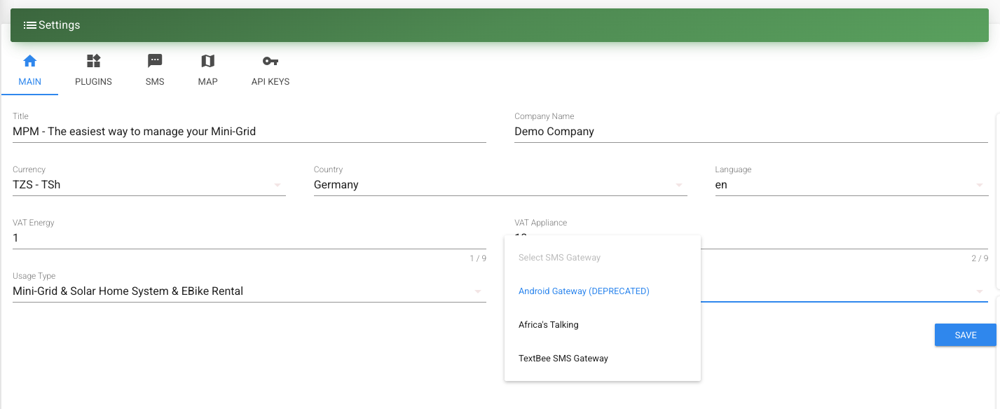

# SMS/Messages

SMS is the key communication infrastructure.
It is used during `Transactions` and `Maintenance` requests.
Headquarter staff can therefore send SMS to customers, agents and service providers via the website interface.
Furthermore, it can also be used by the company to reach out to its entire (or part of its) customer base, in instances such as wanting to inform on a specific event (such a planned/unplanned electricity cut in case of mini-grid operation, or a marketing campaign).
That is the reason why `SMS` is listed in the sidebar as an extra service.

The manager/admin can send SMS's to the customers of a specific Mini-Grid, to a specific customer group/type or single customers.

## SMS Gateway Options

MicroPowerManager supports multiple SMS gateway options:

1. **AfricasTalking** - Traditional SMS provider with wide coverage across Africa
2. **TextBee SMS Gateway** - Cost-effective solution using your own Android device
3. **Android Gateway** - ⚠️ **DEPRECATED** - Legacy fallback option (use TextBee instead)

> **⚠️ Important Note:** The built-in Android Gateway is deprecated and will be removed in a future release. We strongly recommend using **TextBee SMS Gateway** as a modern, more reliable alternative for Android-based SMS delivery. TextBee offers better reliability, monitoring, and support compared to the legacy Android Gateway.

## SMS Gateway Setup Guides

Choose your preferred SMS gateway and follow the detailed setup guide:

### TextBee SMS Gateway (Cost-Effective)

TextBee allows you to use your own Android device as an SMS gateway, providing up to 98% cost savings compared to traditional SMS providers.

**Key Features:**

- Up to 98% cost savings
- Uses your own Android device
- Free plan: 300 messages/month
- Pro plan: 5,000 messages/month

👉 [Complete TextBee Setup Guide](/integrations-guide/textbee)

---

### AfricasTalking (Recommended for High Volume)

AfricasTalking provides reliable, high-volume SMS delivery with wide coverage across Africa and detailed analytics.

**Key Features:**

- High-volume capacity (1000+ messages/month)
- 99.9% uptime guarantee
- Detailed delivery reports
- Wide coverage across Africa
- Additional services (USSD, Voice, Airtime)

👉 [Complete AfricasTalking Setup Guide](/integrations-guide/africastalking)

---

## Configuring Your SMS Gateway

After enabling and configuring one or more SMS gateway plugins, you must select which gateway to use for sending messages.

### Setting Your Preferred SMS Gateway

1. Navigate to **Settings** → **Configuration** → **Main Settings**
2. Scroll to the **SMS Gateway** dropdown field
3. Select your preferred gateway from the available options:
   - **Africa's Talking** - Available when the AfricasTalking plugin is enabled
   - **TextBee SMS Gateway** - Available when the TextBee plugin is enabled
   - **Viber Messaging** - Available when the Viber plugin is enabled
4. Click **Save** to apply your selection

> **Important:** You must have at least one SMS gateway plugin enabled and configured before you can select it in the settings. The dropdown will only show gateways that are currently active.

### Legacy Android Gateway

> **⚠️ Migration Notice:** The built-in Android Gateway is deprecated and no longer available for selection. If you are currently using the Android Gateway, please migrate to **TextBee SMS Gateway**. TextBee provides the same Android-based SMS functionality with improved reliability, better monitoring, and active support. The migration process is simple and can be completed in under 10 minutes.

## Choosing the Right SMS Gateway

### Use AfricasTalking if

- You need high-volume SMS delivery (1000+ messages/month)
- You require guaranteed delivery rates
- You need delivery reports and analytics
- You have budget for per-message costs

### Use TextBee SMS Gateway if

- You want to minimize SMS costs (up to 98% savings)
- You have a reliable Android device available
- Your message volume is moderate (under 5000/month)
- You want full control over your SMS infrastructure
