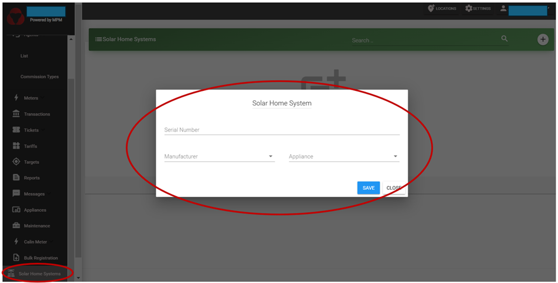

# Solar Home Systems

This is the section listing all SHS devices registered under your company account.
It is the analogous section to the "Meter" menu for mini-grid connections.

SHS devices can be registered via the Customer Registration App (see "Android Apps" section) or directly through the website interface (Select "Solar Home System" menu on the left sidebar --> Click ":heavy_plus_sign:" --> introduce device data as requested.)

