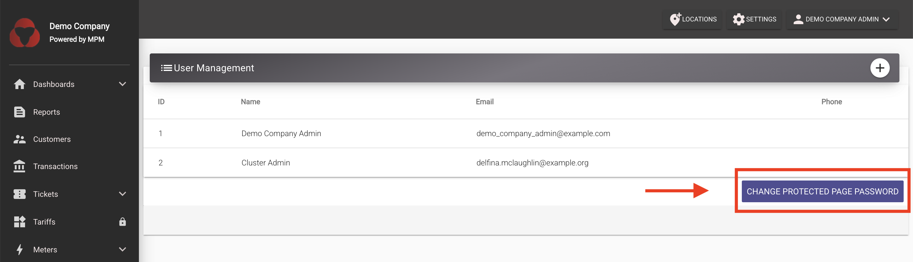

# User Management and Access Control

This guide explains how user accounts and access control work in **MicroPowerManager**.

## User Management

A **user account** is required for every individual who needs access to the company's (tenant's) MicroPowerManager system.

This includes:

- Project developer staff who use the **web interface**.
- Field employees working with the **Customer Registration Android app**.

Each user account is **personal** and provides access to:

- The MicroPowerManager **web interface**.
- The **Customer Registration Android app**.

Additionally, user accounts can be assigned to a cluster if the user’s responsibilities are linked to a specific operational cluster.

## Access Control and administration

The MicroPowerManager web interface provides access to certain sensitive areas that are reserved for **administrative tasks**.

These include:

- Managing company-wide settings.
- Configuring tariffs and targets.
- Adding new locations (villages, mini-grids, clusters).

The [Android Apps](/usage-guide/android-apps), by design, **do not** include administrative capabilities.
This ensures:

- Enhanced security for sensitive operations.
- A focused experience for field staff working on customer registration and data collection.

> [!INFO]
> All administrative actions must be performed through the web platform.
> Field employees using the mobile apps do **not** have access to these protected areas.

### Protected Pages Password

Access to sensitive areas on the web platform is protected by a **Protected Pages Password**.
This password acts as an additional layer of security on top of standard user login credentials.

> [!WARNING]
> Entering an incorrect Protected Pages Password will redirect the user back to the **home page**.

The **Protected Pages Password** is:

- Set during **company (tenant) registration**.
- Shared across **all user accounts** within the company.
- Distinct from a user’s personal login password.

You can update this password at any time via: `Settings → User Management` in the web platform.

## Summary

| Feature                      | Who it applies to               | Notes                                              |
| ---------------------------- | ------------------------------- | -------------------------------------------------- |
| **User Account**             | Individual employees            | Used to log into web and Customer Registration app |
| **Protected Pages Password** | All users in a company (tenant) | Shared at tenant level.                            |
